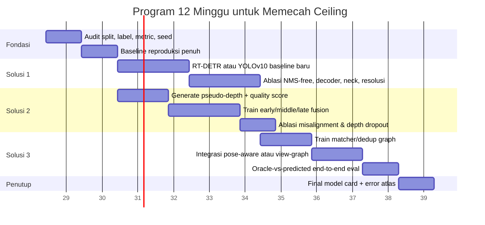
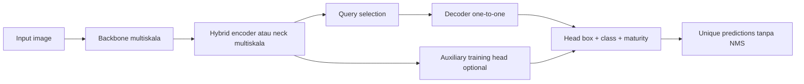
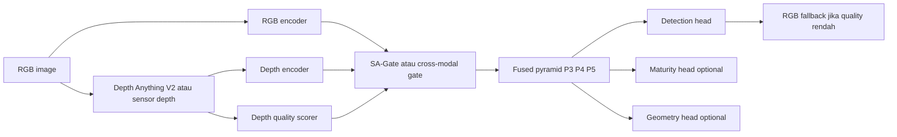
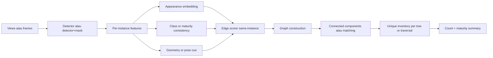

# Strategi Menembus Performance Ceiling Setelah Tuning Ekstensif

## Ringkasan eksekutif

Dokumen review yang Anda unggah bukan sekadar survei umum: ia memetakan **182 sumber primer terverifikasi** dan secara eksplisit menyimpulkan bahwa untuk masalah oil-palm fresh fruit bunch (FFB), baseline yang paling defensibel adalah **detektor RGB real-time multiskala**, sementara **depth harus diperlakukan sebagai cue geometrik yang kondisional** dan **feature fusion atau late fusion yang quality-aware** harus diuji sebagai hipotesis, bukan diasumsikan unggul. Review itu juga menegaskan bahwa evaluasi yang benar tidak boleh berhenti pada AP, tetapi harus mencakup **deteksi, maturity, geometri, asosiasi/count, dan deployment latency**. fileciteturn0file0

Paper **SawitMVC** yang Anda unggah memperkuat diagnosis tersebut di level data. Dataset ini berisi **3992 gambar smartphone dari 953 pohon**, dengan **9823 tandan unik**, anotasi bounding box empat kelas maturity, serta **tautan identitas lintas-view** per pohon. Pada baseline mereka, counting sederhana berbasis SVR sudah cukup kuat jika diberi deteksi oracle, tetapi performanya turun nyata ketika menggunakan prediksi detector; ini menunjukkan bahwa pada pipeline end-to-end, **bottleneck utama tetap berada di deteksi/instance separation**, lalu baru di tahap deduplikasi. fileciteturn0file1

Berdasarkan kombinasi dua file Anda dan paper primer resmi, diagnosis saya adalah: jika performa sudah mentok setelah tuning batch size, LR, input size, augmentasi biasa, dan hyperparameter lain, maka penyebab yang paling mungkin **bukan lagi tuning lokal**, melainkan salah satu dari empat hal berikut: **ceilings arsitektural** (misalnya NMS, kapasitas multiskala, query assignment, atau backbone/neck), **ceilings representasional** (occlusion, crowding, ambiguitas depth/geometry), **ceilings objektif** (melatih untuk AP frame-level padahal target final adalah unique count atau maturity-per-instance), atau **ceilings data/evaluasi** (kelas ambigu, strata kecil/occluded, split tidak cukup keras, atau metrik yang tidak membuka failure mode). fileciteturn0file0turn0file1

Dari lebih dari 20 ide yang layak dicoba, tiga solusi dengan probabilitas tertinggi untuk benar-benar menembus ceiling adalah sebagai berikut.

Pertama, **mengganti inti detektor ke arsitektur end-to-end NMS-free multiskala**. Alasan utamanya adalah bahwa NMS, assignment, dan kualitas fusion multiskala sering menjadi ceiling struktural pada skenario objek rapat/bertumpuk. RT-DETR memberi jalur end-to-end set prediction dengan encoder hybrid multiskala dan fleksibilitas jumlah decoder layer, sedangkan YOLOv10 memberi rute NMS-free yang lebih ringan di ekosistem YOLO. citeturn0search2turn4academia49turn4academia48turn1search0

Kedua, **menambahkan cabang depth yang quality-aware melalui middle fusion, dengan fallback RGB eksplisit**. Ini penting bukan karena “depth selalu membantu”, tetapi karena literature yang Anda unggah justru menekankan kebalikannya: depth berguna hanya bila reliabilitasnya dikendalikan. Ophoff menunjukkan middle/late fusion cenderung mengalahkan early fusion untuk RGB+depth pada real-time detection; SA-Gate dan D3Net menunjukkan bahwa mekanisme gating yang menyaring depth buruk sebelum fusion adalah kunci saat depth noisy atau salah-registrasi. Depth Anything dan Depth Anything V2 memberi jalur practical jika Anda tidak punya sensor depth yang stabil. fileciteturn0file0 citeturn0search0turn0search6turn2search5turn2academia50turn0search5turn5academia46turn6search0turn6academia24

Ketiga, **mengubah unit masalah dari prediksi per-frame menjadi inventory unik lintas-view atau lintas-waktu**, dengan instance-aware association atau deduplication graph. Ini sangat penting jika metrik final Anda ternyata count, unique object inventory, atau maturity attached to the right instance. Review Anda menegaskan bahwa target operasional FFB adalah sequence-level inventory, dan SawitMVC memberi bukti bahwa tanpa deduplikasi lintas-view, penjumlahan naif akan overcount. Pada domain buah lain, kombinasi instance segmentation dan geometri multi-view sudah pernah meningkatkan fruit localization dibanding 2D-only; itu bukan bukti langsung untuk sawit, tetapi transfer evidence-nya kuat. fileciteturn0file0turn0file1 citeturn1search1turn3academia49turn3search0

Singkatnya, jika saya harus memilih urutan eksekusi yang paling rasional, saya akan menjalankan program berikut: **Solusi 1 dulu** untuk memecah ceiling struktural deteksi; **Solusi 2 kedua** untuk menguji apakah informasi geometri benar-benar membuka error mode yang tak tersentuh RGB-only; lalu **Solusi 3** untuk memindahkan performa dari sekadar “bagus di frame” menjadi “benar di level inventory”. Urutan ini paling robust terhadap ketidakjelasan dataset, family, compute budget, dan metric akhir. fileciteturn0file0turn0file1

## Asumsi kerja dan diagnosis sumber ceiling

Karena Anda sengaja membiarkan beberapa atribut tidak dispesifikkan, saya perlu membuat asumsi eksplisit agar rencana implementasi tetap operasional.

| Aspek yang belum dispesifikkan | Asumsi default yang saya pakai | Konsekuensi praktis | Alternatif bila asumsi salah |
|---|---|---|---|
| Karakteristik dataset | Data deteksi/instance-level dengan objek multi-skala, sebagian occluded, dan kemungkinan crowding | Solusi 1 dan 2 menjadi prioritas | Jika dataset sangat bersih dan objek besar, prioritas bisa bergeser ke loss/data curation |
| Family model saat ini | Satu-stage detector atau model vision umum yang sudah dituning berat | Ceiling kemungkinan berasal dari assignment, NMS, dan representasi multiskala | Jika model sekarang classifier murni, gunakan analogi backbone/depth/multi-view di level patch/class token |
| Compute budget | Tidak diketahui; perlu tiga tier: rendah, sedang, tinggi | Semua rencana saya sertakan varian low/med/high compute | Jika compute sangat sempit, gunakan YOLOv10-S/M dan pseudo-depth offline |
| Target metric | Tidak diketahui; saya asumsikan salah satu dari AP, F1, MAE count, atau latency-constrained score | Saya sengaja memilih top-3 yang relatif robust di banyak metric | Jika metric murni classification accuracy, Solusi 3 turun prioritas |
| Reproducibility | Harus tinggi | Semua eksperimen saya desain dengan seed, split keras, oracle-vs-predicted separation, dan ablation minimal | Jika reproduksibilitas bukan prioritas, Anda bisa mempercepat dengan menurunkan breadth ablation |

Diagnostik paling penting dari dua file yang Anda unggah adalah ini. Review 182-sumber menunjukkan bahwa bidang ini berulang kali memecahkan sub-masalah—real-time detection, monocular depth, RGB-D fusion, 3D localization, SLAM, association—tetapi hampir selalu pada objek, sensor, dan metrik selain oil-palm FFB. Funnel pada halaman 17 secara visual menekankan adanya **transfer gap** dari visi umum ke sawit. Artinya, ketika model Anda stagnan, Anda tidak boleh langsung menyimpulkan “arsitektur saya jelek”; bisa jadi yang salah adalah **unit evaluasi**, **cara fusion**, atau **kesesuaian representasi dengan failure mode lapangan**. fileciteturn0file0

SawitMVC memberi petunjuk tambahan yang sangat praktis. Dataset ini memiliki split yang sudah terdefinisi per pohon, linkage identitas lintas-view, dan baseline yang memisahkan kualitas counting dari kualitas detector. Pada tabel hasil mereka, performance counting dengan ground-truth detections jauh lebih baik daripada performance counting dengan hasil detector, sehingga **detector error masih mendominasi pipeline**, bukan sekadar counter. Ini berarti bahwa strategi “menambah counter yang lebih pintar” tanpa membenahi separasi instance dan recall deteksi kemungkinan besar hanya memberi gain kecil. fileciteturn0file1

Dengan kata lain, “hard ceiling” yang Anda alami kemungkinan besar berasal dari salah satu tiga bentuk mismatch berikut. Pertama, **mismatch arsitektur-ke-error mode**: model cepat tetapi gagal memisah instance rapat, gagal pada small object, atau menghasilkan duplicate/merge akibat NMS atau assignment. Kedua, **mismatch representasi-ke-geometri**: RGB saja tidak cukup ketika dua objek mirip berada pada layer kedalaman berbeda, tetapi depth juga tidak boleh dimasukkan mentah-mentah. Ketiga, **mismatch objective-ke-deployment**: model dilatih untuk box score per gambar, padahal yang Anda butuhkan adalah label maturity yang menempel ke instance yang benar dan unique count tanpa re-observation. fileciteturn0file0turn0file1

## Matriks ide yang layak untuk menembus ceiling

Tabel berikut merangkum **24 ide berbeda**. Saya sengaja menaruh ide arsitektural di depan, lalu ide depth/fusion, lalu ide data, loss, optimisasi, dan evaluasi. “Dampak” di sini adalah **ekspektasi kualitatif** pada situasi ceiling pasca-tuning, bukan janji angka.

| Ide | Kategori | Perubahan inti | Kelebihan | Kekurangan | Dampak ekspektasian | Risiko | Basis sumber |
|---|---|---|---|---|---|---|---|
| Detektor end-to-end NMS-free berbasis RT-DETR | Arsitektur | Ganti head/post-processing ke set prediction one-to-one | Mengurangi merge/duplicate karena tidak bergantung pada NMS; bagus untuk crowded objects | Lebih sensitif ke setup training dan compute | Sangat tinggi jika ceiling berasal dari duplicate/merge | Sedang | citeturn0search2turn4academia49 |
| YOLOv10 NMS-free sebagai jalur ringan | Arsitektur | Tetap di ekosistem YOLO tetapi hilangkan ketergantungan NMS | Lebih mudah diadopsi bila stack sudah YOLO-heavy | Gain bisa lebih kecil daripada perombakan total ke DETR | Tinggi untuk latency+dedup | Rendah–sedang | citeturn4academia48 |
| Neck multiskala lebih kuat | Arsitektur | Upgrade FPN/PAN ke BiFPN atau Gather-and-Distribute | Menyerang error small-object dan skala beragam | Bisa menambah latency | Tinggi bila miss pada objek kecil/jauh dominan | Sedang | citeturn1search0turn4search0 |
| Aux mask branch atau Mask R-CNN baseline | Arsitektur | Tambahkan mask per instance atau uji two-stage mask baseline | Unit objek lebih eksplisit; membantu pemisahan instance bertumpuk | Berat; real-time lebih sulit | Tinggi untuk crowding/occlusion | Sedang–tinggi | citeturn1search1 fileciteturn0file0 |
| Sparse R-CNN atau proposal set kecil | Arsitektur | Learnable proposals, NMS-free end-to-end | Elegan untuk instance uniqueness | Ekosistem dan tooling lebih kecil | Sedang–tinggi pada crowded scenes | Sedang | fileciteturn0file0 |
| Backbone lebih dalam dengan residual/ConvNeXt/Swin | Arsitektur | Tingkatkan kapasitas representasi backbone | Menangkap cue tekstur dan konteks lebih baik | Ceiling data bisa membuat kapasitas tambahan mubazir | Sedang | Sedang | fileciteturn0file0 |
| Deep supervision pada beberapa skala | Arsitektur/training | Supervisi di beberapa layer/head | Menstabilkan training dan small-object learning | Butuh tuning loss weights | Sedang | Rendah | fileciteturn0file0 |
| Query assignment hybrid one-to-many + one-to-one | Arsitektur/training | Satu head kaya supervisi saat training, satu head clean saat inference | Sering membantu konvergensi dan kualitas instance | Implementasi lebih kompleks | Tinggi | Sedang | citeturn4academia48 fileciteturn0file0 |
| Middle fusion RGB-depth yang quality-aware | Fusion | Encoder terpisah RGB/depth, fusion di feature pyramid dengan gate | Secara mekanistik paling masuk akal untuk depth noisy | Butuh depth branch dan ablation serius | Sangat tinggi bila geometri penting | Sedang–tinggi | citeturn0search0turn0search6turn2search5turn2academia50 |
| Late fusion dengan fallback RGB eksplisit | Fusion | Gabungkan skor/head akhir dengan confidence weighting | Aman saat depth intermittent | Bisa kehilangan cue halus lintas-modal | Sedang–tinggi | Rendah | fileciteturn0file0 citeturn0search0 |
| Early fusion 4-channel sebagai baseline wajib | Fusion | Concat RGB + depth di input | Murah, mudah, baseline fair | Sering kalah dari middle/late fusion | Rendah–sedang, tapi penting sebagai kontrol | Rendah | citeturn0search0turn0search6 |
| Pseudo-depth dari Depth Anything V2 | Training/data | Tambahkan peta depth foundation-model tanpa sensor | Praktis jika tidak ada sensor depth | Error depth berkorelasi dengan RGB; bisa menyesatkan | Tinggi bila occlusion/geometri dominan | Sedang | citeturn0search5turn5academia46 |
| Metric calibration dengan Metric3D atau ZoeDepth | Geometry | Ubah relative depth ke depth yang lebih bermakna untuk geometri | Penting jika range/3D localization dievaluasi | Tidak selalu membantu AP box | Sedang–tinggi untuk geometri/count | Sedang | citeturn6search0turn6academia24 |
| Multi-task head untuk detection + maturity + geometry | Arsitektur/objective | Encoder bersama, head spesifik tugas | Shared representation lebih efisien | Negative transfer antar-head bisa muncul | Tinggi bila target Anda multi-output | Sedang | fileciteturn0file0 |
| Deduplikasi lintas-view berbasis graph matching | Pipeline | Prediksi edge same-instance lalu connected components | Menyerang overcount langsung | Butuh anotasi link atau pseudo-link yang baik | Sangat tinggi untuk count metric | Sedang | fileciteturn0file1turn0file0 |
| Asosiasi pose-aware dengan SLAM/SfM | Pipeline/geometry | Gunakan pose kamera untuk validasi identitas | Mengurangi duplicate re-observation | Tambah kompleksitas, drift mungkin merusak | Tinggi untuk sequence inventory | Tinggi | fileciteturn0file0 citeturn3academia49 |
| Instance segmentation + multi-view geometry | Pipeline | Combine mask dengan SfM/projection | Transfer evidence bagus untuk fruit counting | Proses lambat | Tinggi jika final target unique count | Sedang–tinggi | fileciteturn0file0 citeturn1search1turn3search0 |
| Loss redesign dengan focal/class-balanced weighting | Loss | Reweight easy background dan kelas minor | Sering memberi gain cepat pada imbalance | Tidak memecah ceiling struktural | Sedang | Rendah | citeturn1search6 |
| IoU-aware / localization-heavy box loss | Loss | Naikkan penalti localization error | Membantu AP75/close-fit | Bisa menurunkan recall bila terlalu agresif | Sedang | Rendah–sedang | fileciteturn0file0 |
| Curriculum resolution dan patch mining | Data/training | Mulai resolusi moderat lalu naik; fokus crop keras | Efektif untuk small object | Pipeline data lebih rumit | Tinggi bila objeck kecil/jauh dominan | Rendah–sedang | fileciteturn0file0 |
| Hard-negative mining berbasis strata occlusion/illumination | Data/training | Sampling ulang frond/shadow/soil confusers | Menarget error nyata lapangan | Harus ada metadata strata | Sedang–tinggi | Rendah | fileciteturn0file0 |
| Self-supervised atau MAE-style pretraining domain lokal | Training paradigm | Pretrain pada citra tak berlabel in-domain | Sering menaikkan transfer dan stabilitas | Butuh corpus tak berlabel dan waktu | Tinggi pada domain shift besar | Sedang | citeturn4search0 fileciteturn0file0 |
| Synthetic/copy-paste/domain randomization | Data | Tambah variasi occlusion, scale, clutter | Cepat memperkaya tail cases | Mudah menghasilkan artefak | Sedang–tinggi | Sedang | fileciteturn0file0 |
| Active learning dan relabel kelas ambigu | Data/QA | Fokus re-annotasi pada sampel paling tidak pasti | Sangat efisien terhadap label noise | Butuh loop anotasi manusia | Tinggi bila label ambiguity besar | Rendah | fileciteturn0file1 |
| Kalibrasi threshold per strata | Evaluation/decision | Threshold berbeda untuk size/illumination/crowding | Sering memberi gain deployment nyata | Bisa overfit val set | Sedang | Rendah | fileciteturn0file0 |
| Redesain evaluasi ke metric hierarchy | Evaluation | Laporkan deteksi, maturity, geometri, count, latency terpisah | Membuka sumber ceiling yang sebenarnya | Tidak langsung menaikkan metrik tunggal | Dampak tidak langsung, tapi sangat penting | Rendah | fileciteturn0file0turn0file1 |

Jika saya harus mengelompokkan semua ide itu ke dalam prioritas praktis, saya akan membacanya sebagai tiga lapisan. Lapisan pertama adalah **perombakan inti model**: ide-ide yang menyentuh set prediction, NMS, multiscale neck, dan mask branch. Lapisan kedua adalah **perombakan representasi**: depth, quality gating, metric calibration, multi-task heads. Lapisan ketiga adalah **perombakan objective dan evaluasi**: deduplication graph, pose-aware association, metric hierarchy, dan split/evaluation redesign. Pada kasus “hard ceiling”, lapisan pertama dan ketiga biasanya memberi lompatan terbesar; lapisan kedua adalah multiplier yang sangat kuat bila failure mode Anda memang geometrik. fileciteturn0file0turn0file1

## Mengapa tiga solusi ini dipilih

Saya memilih top-3 bukan hanya berdasarkan “kecanggihan”, tetapi dengan empat kriteria yang lebih keras: **probabilitas memecah ceiling**, **ketahanan terhadap item yang belum dispesifikkan**, **kekuatan evidence primer**, dan **reproducibility**.

**Solusi terbaik pertama** adalah detektor end-to-end NMS-free multiskala karena ia menyerang penyebab ceiling yang paling universal: duplicate suppression, box conflict, dan keterbatasan pemodelan multi-skala. Dibanding sekadar memperdalam backbone, solusi ini mengubah aturan permainan pada tahap assignment dan output formation. RT-DETR menunjukkan bahwa set prediction real-time bisa sekaligus cepat dan akurat, sementara YOLOv10 memberi opsi lebih ringan jika Anda ingin tetap berada di jalur YOLO. citeturn0search2turn4academia49turn4academia48

**Solusi terbaik kedua** adalah middle fusion depth yang quality-aware karena review Anda sendiri menekankan bahwa depth bukan tambahan kanal yang otomatis baik. Ketika sensor depth atau pseudo-depth buruk, fusion yang salah justru menurunkan performa. Karena itu, ide “gunakan depth” terlalu kasar; ide yang benar adalah **gunakan depth hanya bila ia lolos mekanisme reliabilitas**. Ophoff, SA-Gate, dan D3Net secara kolektif mendukung mekanisme ini. fileciteturn0file0 citeturn0search0turn0search6turn2search5turn2academia50

**Solusi terbaik ketiga** adalah deduplikasi lintas-view atau lintas-waktu karena, pada domain FFB, problem finalnya bukan box bagus per frame, melainkan inventaris unik per objek dengan maturity yang benar. Review Anda sangat eksplisit soal ini, dan SawitMVC menyediakan struktur ground truth yang tepat untuk menguji hipotesis tersebut. Jika metric Anda nanti ternyata hanya AP frame-level, solusi ini memang tidak akan terlihat paling spektakuler. Tetapi jika target akhirnya count, unique inventory, forecast input, atau deployable field output, justru inilah salah satu sumber gain terbesar yang tidak bisa dicapai lewat tuning detector saja. fileciteturn0file0turn0file1

Berikut roadmap eksekusi yang saya sarankan jika Anda ingin mencari gain secepat mungkin tetapi tetap ilmiah.

Roadmap ini saya sengaja susun agar **Solusi 2 dan 3 tidak berjalan buta**. Solusi 2 harus diuji terhadap baseline kuat dari Solusi 1, dan Solusi 3 harus dievaluasi baik dengan deteksi oracle maupun hasil detector, karena SawitMVC menunjukkan bahwa pemisahan dua level error itu sangat penting. fileciteturn0file1turn0file0

## Panduan implementasi ultra-rinci untuk tiga solusi terbaik

### Solusi pertama

#### Detektor end-to-end NMS-free multiskala

Solusi ini saya definisikan sebagai keluarga arsitektur yang memindahkan output dari pola “banyak kandidat lalu dibersihkan oleh NMS” ke pola “set prediksi yang sejak awal dipaksa satu-instance-satu-prediksi”, sambil tetap menjaga kemampuan multiskala. Secara praktis, saya menyarankan **RT-DETR sebagai implementasi primer**, dan **YOLOv10 sebagai varian low-friction** bila stack Anda sangat bergantung pada tooling YOLO. FPN atau neck multiskala lain tetap relevan sebagai komponen pendukung. citeturn0search2turn4academia49turn4academia48turn1search0

Langkah implementasinya saya sarankan seperti ini.

1. **Bekukan baseline terbaik Anda sekarang**. Simpan seed, split, preprocessing, threshold, dan script evaluasi. Jangan ganti apa pun selain model family pada fase pertama. Tujuannya agar setiap gain benar-benar bisa diatribusikan ke arsitektur, bukan ke recipe baru.

2. **Pisahkan tiga strata error sebelum training model baru**: objek kecil/jauh, objek occluded/crowded, dan objek “duplicate-prone”. Jika Anda belum punya metadata strata, buat versi pragmatis: kuantil area bbox untuk size, crowd index sederhana dari overlap antar-GT box, dan indikator occlusion manual pada subset audit. Review Anda menekankan bahwa aggregate AP dapat menyembunyikan hilangnya objek kecil atau tertutup; karena itu strata ini wajib. fileciteturn0file0

3. **Mulai dari satu varian primer saja**.  
   Untuk compute rendah: YOLOv10-S atau RT-DETR-R18 pada `imgsz 640`.  
   Untuk compute sedang: RT-DETR-R50 pada `imgsz 800` atau YOLOv10-M pada `imgsz 768–896`.  
   Untuk compute tinggi: RT-DETR-R50/R101 atau kombinasi RT-DETR + stronger backbone pada `imgsz 960–1024`.  
   Jika family lama Anda YOLO dan Anda perlu “drop-in replacement”, mulai dari YOLOv10. Jika Anda ingin memecah ceiling secara paling teoretis, mulai dari RT-DETR. citeturn0search2turn4academia49turn4academia48

4. **Gunakan schedule training dua tahap**.  
   Tahap A, `10–15 epoch` pertama: backbone learning rate lebih kecil daripada head, augmentasi sedang, fokus stabilisasi konvergensi.  
   Tahap B, `90–150 epoch` berikutnya: full fine-tuning, multiscale training aktif, dan evaluasi periodik per strata.  
   Untuk optimizer, saya merekomendasikan **AdamW** pada varian DETR-style dan **SGD/AdamW yang konsisten dengan implementation resmi** pada varian YOLO-style. Jangan mengubah terlalu banyak komponen sekaligus di siklus pertama.

5. **Hyperparameter awal yang masuk akal** untuk eksperimen primer adalah:  
   `batch = 16/32/64` sesuai tier compute, `warmup = 1000–2000 iter`, `weight_decay = 1e-4`, `gradient_clip = 0.1` pada DETR-style, dan `EMA = off` untuk siklus ablation pertama agar interpretasi bersih. Jika data sangat kecil, aktifkan freeze backbone pendek `5–10 epoch`; jika data cukup besar, langsung fine-tune penuh.

6. **Ablasi minimal yang wajib** hanya empat buah.  
   Pertama, **baseline lama vs model baru** pada recipe sedekat mungkin.  
   Kedua, **jumlah decoder layer** atau complexity head, karena RT-DETR memang mendukung speed tuning lewat decoder depth.  
   Ketiga, **resolusi input**, karena banyak ceiling semu ternyata murni small-object resolution bottleneck.  
   Keempat, **neck multiskala standar vs neck lebih kuat** bila implementasi mendukung. citeturn0search2turn4search0

7. **Metrik evaluasi jangan hanya AP50**. Laporkan minimal: `AP50`, `AP75`, `APs/APm/APl`, recall pada crowded subset, jumlah split/merge, duplicate-like predictions, latency end-to-end pada hardware target, dan bila tugas Anda count/maturity, laporkan juga error setelah pipeline downstream. Review Anda tegas bahwa deployment evidence harus mencakup bukan hanya akurasi, tetapi juga throughput, memori, hardware, dan availability depth. fileciteturn0file0

8. **Failure-mode diagnostics** harus dibaca secara visual, bukan hanya numerik. Buat empat atlas error:  
   atlas objek kecil hilang,  
   atlas objek rapat yang merge jadi satu,  
   atlas duplicate predictions sekitar objek sama,  
   atlas kesalahan maturity attached to wrong box.  
   Jika model baru menaikkan AP tapi duplicate-like predictions di crowding naik, itu tanda ceiling pindah, bukan hilang.

9. **Decision rule** untuk mengatakan solusi ini berhasil jangan dibuat lunak. Saya sarankan: solusi dianggap lolos jika ia konsisten lebih baik pada minimal dua dari tiga sumbu berikut: `AP75 / crowded recall / count error downstream`, tanpa merusak latency secara tidak dapat diterima.

#### Paket ablation yang saya rekomendasikan

| Ablasi | Tujuan | Interpretasi |
|---|---|---|
| Baseline lama vs RT-DETR | Menguji ceiling struktural | Jika gain muncul terutama pada crowding/duplicate, asumsi “NMS/assignment ceiling” benar |
| RT-DETR 3 vs 6 decoder layers | Menguji trade-off konteks vs latency | Jika gain kecil tapi latency naik besar, pilih varian dangkal |
| YOLOv10 vs RT-DETR | Menguji seberapa besar perubahan family diperlukan | Jika YOLOv10 sudah mendekati RT-DETR, Anda bisa tetap di stack YOLO |
| Resolusi 640 vs 800 vs 960 | Menguji apakah masalah inti hanya resolusi | Jika gain mayor datang dari resolusi, jangan overclaim arsitektur |
| Neck standar vs stronger neck | Menguji ceiling multiskala | Jika objek kecil yang membaik, bottleneck ada di feature fusion multiskala |

#### Protocol evaluasi yang saya anggap ideal

Gunakan satu validation split untuk pemilihan model dan satu test split yang tidak disentuh untuk laporan final. Jika data Anda memiliki struktur pohon, blok, sesi, atau traversal seperti SawitMVC, split harus memisahkan unit-unit itu, bukan frame acak, agar model tidak sekadar menghafal background. fileciteturn0file1turn0file0

### Solusi kedua

#### Pseudo-depth atau sensor depth dengan middle fusion quality-aware

Jika Solusi 1 menyerang ceiling di level assignment/output, Solusi 2 menyerang ceiling di level **representasi geometri**. Review Anda memberi tesis yang sangat jelas: depth bisa membantu separasi layer dan stabilisasi geometri, tetapi depth juga bisa hilang, noisy, salah register, non-metric, dan sangat rapuh di luar ruang. Karena itu, eksperimen depth yang benar bukan “RGB vs RGBD”, melainkan **RGB-only vs early fusion vs middle fusion gated vs late fusion fallback**, dengan kondisi depth rusak diuji secara eksplisit. fileciteturn0file0 citeturn0search0turn0search6turn2search5turn2academia50

Cara implementasi yang paling rasional adalah sebagai berikut.

1. **Jangan mulai dari sensor fusion bila Anda belum punya baseline RGB kuat**. Solusi 2 harus berdiri di atas model dari Solusi 1, bukan menggantikannya. Jika baseline RGB belum solid, Anda tidak akan tahu apakah gain depth itu nyata atau hanya menutupi baseline yang lemah.

2. **Bangun bank depth offline lebih dulu**.  
   Jika Anda punya sensor depth yang terkalibrasi dan stabil, pakai itu sebagai cabang utama.  
   Jika tidak, generate pseudo-depth dengan **Depth Anything V2** untuk seluruh dataset. Bila target Anda butuh jarak yang lebih bermakna, siapkan branch alternatif dengan **Metric3D** atau **ZoeDepth** pada subset yang memiliki intrinsics/metric labels. Depth Anything V2 menawarkan model dari skala kecil sampai sangat besar dan secara eksplisit difokuskan pada robust monocular depth; Metric3D dan ZoeDepth relevan jika Anda butuh interpretasi depth yang lebih dekat ke metric geometry. citeturn5academia46turn0search5turn6search0turn6academia24

3. **Hitung quality score untuk setiap peta depth**. Saya menyarankan lima komponen, dinormalisasi ke `[0,1]`:  
   rasio piksel valid,  
   konsistensi edge RGB-depth,  
   hole/noise ratio,  
   temporal stability pada sequence yang berdekatan,  
   dan image-condition proxy seperti overexposure/sunlight severity.  
   Komponen ini tidak harus sempurna pada iterasi pertama; yang penting ia cukup baik untuk memisahkan depth “layak pakai” dari depth “berpotensi merusak”.

4. **Latih empat konfigurasi secara paralel**:  
   RGB-only,  
   early fusion 4-channel,  
   middle fusion dengan gate,  
   late fusion dengan weighted head aggregation.  
   Ophoff menunjukkan bahwa middle dan late fusion secara umum lebih kompetitif daripada early fusion pada real-time RGB+depth detection; maka early fusion harus ada hanya sebagai kontrol, bukan kandidat utama. citeturn0search0turn0search6

5. **Lokasi fusion yang saya rekomendasikan adalah P3–P5** atau tiga skala feature menengah-atas. Jangan fusion terlalu dini kecuali Anda benar-benar ingin menguji early baseline. SA-Gate memberi motif yang bagus di sini: filter dulu, baru fuse. Poin kuncinya adalah depth branch harus tetap punya spesifisitas cukup lama agar model dapat “memutuskan” kapan depth berguna dan kapan harus ditekan. citeturn2search5turn2search0

6. **Hyperparameter awal yang saya rekomendasikan**:  
   backbone RGB mengikuti model Solusi 1,  
   depth encoder kecil-menengah agar biaya tidak meledak,  
   fusion blocks pada tiga skala,  
   `depth_dropout = 0.3` selama training agar model belajar fallback,  
   loss weight awal `det = 1.0`, `maturity = 0.5`, `geometry = 0.25`, `gate_reg = 0.01`.  
   Saya sarankan depth foundation model **dibekukan pada siklus pertama**; hanya unfreeze sebagian kecil jika hasil awal menjanjikan dan compute cukup.

7. **Ablasi inti untuk solusi ini** harus lebih keras daripada eksperimen biasa.  
   Ablasi A: pseudo-depth vs sensor depth, jika keduanya tersedia.  
   Ablasi B: relative depth vs metric-oriented depth.  
   Ablasi C: no-gate vs gate.  
   Ablasi D: zeroed depth pada proporsi 10%, 30%, 50% saat training.  
   Ablasi E: misregistration sintetik, misalnya shift depth beberapa piksel.  
   Ablasi F: report terpisah pada strata `sunlit`, `shaded`, `occluded`, `crowded`.

8. **Protocol evaluasi** untuk depth harus menambah satu block baru: kedalaman valid dan dampak geometri. Laporkan detection metrics seperti biasa, lalu tambahkan `depth-valid rate`, `association gain`, `range/position error` jika metric geometry ada, serta `count error` jika pipeline berlanjut ke deduplication. Review Anda menekankan bahwa klaim spasial harus selalu menyebut apakah yang dipakai relative depth, calibrated range, atau full 3D position. fileciteturn0file0

9. **Failure-mode diagnostics** untuk Solusi 2 berbeda dari Solusi 1. Cari lima gejala ini:  
   gate collapse ke RGB-only hampir di semua sampel,  
   gate justru terlalu percaya depth buruk,  
   tepi box tertarik ke depth artefacts,  
   class confusion meningkat di bawah perubahan pencahayaan,  
   dan gain hanya muncul pada validation tetapi hilang di test keras.  
   Jika salah satu terjadi, perbaikannya bukan langsung ganti model, tetapi perketat quality signal dan ubah lokasi fusion.

#### Rencana training yang saya rekomendasikan

| Tahap | Lama | Yang dibekukan | Yang dilatih | Tujuan |
|---|---|---|---|---|
| Build depth bank | sekali | semua | tidak ada | Menyiapkan input depth yang reproducible |
| Stage A | 10–15 epoch | depth model | detector + fusion | Belajar align dua modality tanpa chaos |
| Stage B | 80–120 epoch | depth model | full detector + fusion | Maksimalkan gain representasi |
| Stage C opsional | 20–30 epoch | sebagian backbone | akhir depth encoder + fusion | Fine-tune geometri bila Stage B menjanjikan |

#### Saat solusi ini layak dihentikan

Solusi ini **tidak** layak diteruskan bila tiga hal ini terjadi bersamaan: gain hanya muncul pada AP50 tetapi hilang pada AP75/crowding, gate selalu mematikan depth, dan evaluasi misregistration menunjukkan performa sangat rapuh. Itu berarti depth bukan pembuka ceiling Anda; ia hanya noise tambahan. Sebaliknya, bila middle fusion gated konsisten mengalahkan RGB-only terutama pada strata occluded/crowded/far, maka Anda telah menemukan ceiling geometrik yang nyata. fileciteturn0file0 citeturn0search0turn2search5turn2academia50

### Solusi ketiga

#### Inventory unik lintas-view atau lintas-sequence dengan deduplikasi berbasis graf

Solusi ini mengubah target optimasi. Jika Solusi 1 dan 2 masih beroperasi terutama di level per-image representation dan prediction, Solusi 3 bekerja di level **identity, association, dan unique count**. Review Anda berkali-kali menegaskan bahwa FFB perception secara operasional bukan sekadar box detection; ia harus menghindari re-counting pada kamera bergerak atau multi-view capture. SawitMVC adalah alat yang sangat tepat untuk menguji ide ini karena ia menyediakan per-tree JSON yang merekam link identitas antarsisi, bukan hanya box per gambar. fileciteturn0file0turn0file1

Implementasi ultra-rinci yang saya sarankan adalah seperti berikut.

1. **Tetapkan dulu mode observasi Anda**.  
   Jika data berupa multi-view tetap di sekitar objek seperti SawitMVC, gunakan **view graph per pohon**.  
   Jika data berupa video/traversal, gunakan **temporal graph** dan pertimbangkan **pose dari ORB-SLAM3** atau pendekatan serupa. Jangan mencampur dua mode ini dalam satu eksperimen utama. Mereka harus menjadi dua cabang metodologis yang berbeda. fileciteturn0file1turn0file0 citeturn3academia49

2. **Keluaran detector harus diperkaya**. Minimal Anda butuh:  
   bbox,  
   confidence,  
   maturity score distribution,  
   embedding instance `128–256D`,  
   dan bila memungkinkan mask per instance.  
   Mask sangat berharga karena ia membuat “unit objek” lebih tajam dan membantu menghindari pencampuran foreground-background, sesuatu yang review Anda dan Mask R-CNN sama-sama tekankan. fileciteturn0file0 citeturn1search1

3. **Bangun supervisory signal pairwise** dari JSON atau sequence annotations.  
   Positif: dua deteksi yang merujuk ke objek fisik sama.  
   Negatif mudah: dua deteksi beda pohon/traversal.  
   Negatif keras: dua deteksi pada pohon yang sama, kelas sama, tampilan mirip, tetapi objek berbeda.  
   Negatif keras inilah yang harus diprioritaskan, karena di sanalah over-merge biasanya terjadi.

4. **Latih edge scorer kecil**, bukan langsung graph neural network besar. Model awal yang sangat efektif biasanya cukup berupa MLP dua atau tiga layer di atas fitur gabungan: cosine similarity embedding, selisih area, konsistensi maturity, jarak view index, dan jika ada pose, kompatibilitas geometri. Mulai sederhana dulu agar interpretasinya kuat.

5. **Pilih mekanisme clustering yang reproducible**.  
   Untuk multi-view per pohon: thresholded connected components cukup kuat sebagai baseline.  
   Untuk sequence panjang: Hungarian matching lokal + graph merge global sering lebih stabil.  
   Jangan melompat ke tracker kompleks sebelum baseline graf sederhana mencapai batasnya.

6. **Gunakan dua jalur evaluasi yang benar-benar dipisah**.  
   Jalur oracle: counter/dedup menerima GT detections atau minimally corrected detections.  
   Jalur predicted: counter/dedup menerima output detector sesungguhnya.  
   SawitMVC dengan sangat jelas menunjukkan nilai ilmiah pemisahan ini, karena ia memperlihatkan bahwa kualitas detector dan kualitas dedup harus dinilai terpisah. fileciteturn0file1

7. **Hyperparameter awal yang saya rekomendasikan**:  
   embedding dim `128`,  
   contrastive margin `0.2–0.4` atau temperature `0.07` bila pakai InfoNCE,  
   edge MLP `256 -> 256 -> 1`,  
   positive threshold awal `0.65`,  
   hard negative ratio `2:1` terhadap positive pairs,  
   penalty class mismatch tinggi bila maturity consistency penting.  
   Ini adalah titik awal engineering yang baik; threshold final harus dikalibrasi di validation set.

8. **Tambahkan geometri hanya setelah appearance baseline stabil**. Jika Anda langsung mencampur embedding, mask, dan pose, Anda akan sulit tahu komponen mana yang benar-benar memberi gain. Saya sarankan tiga fase:  
   fase A appearance-only,  
   fase B appearance + class consistency,  
   fase C appearance + class + geometry/pose.  
   Ini membuat inferensi ilmiahnya bersih.

9. **Protocol evaluasi wajib** untuk solusi ini adalah: `Class ±1 accuracy`, `Tree ±1 accuracy`, `macro MAE`, `mean bias`, `duplicate rate`, `over-merge rate`, `fragmentation rate`, dan jika sequence dipakai, `association precision/recall`. Metrik ini selaras dengan satu sisi Table III pada review Anda dan satu sisi Table 4 pada SawitMVC. fileciteturn0file0turn0file1

10. **Failure-mode diagnostics** untuk deduplication graph harus divisualkan sebagai graf, bukan hanya angka. Pada setiap sampel test yang buruk, tampilkan node detections, edge positif terpilih, dan komponen akhir. Cari empat pola khas:  
    satu objek terpecah menjadi beberapa komponen,  
    dua objek mirip salah bergabung,  
    objek yang terlihat samar tidak pernah terhubung,  
    maturity dalam satu komponen saling bertentangan.  
    Keempat pola ini memberi resep perbaikan yang berbeda.

#### Mengapa solusi ini penting walau target metric Anda belum pasti

Jika ternyata metric final Anda cuma AP, Solusi 3 memang bukan prioritas pertama. Tetapi bila metric akhir Anda adalah count atau keputusan operasional per pohon, tidak ada jumlah tuning LR yang bisa menggantikan benar/tidaknya association. SawitMVC secara desain dibuat justru untuk memisahkan dua lapisan ini. Itulah sebabnya saya tetap menempatkan Solusi 3 di top-3, bukan sebagai “opsional belakangan”. fileciteturn0file1turn0file0

## Eksperimen hipotesis kedalaman dan sumber primer prioritas

### Eksperimen untuk memvalidasi hipotesis depth

Karena depth adalah area dengan potensi gain besar sekaligus risiko misinterpretasi besar, saya menyarankan paket hipotesis berikut. Saya sengaja menuliskannya sebagai hipotesis yang bisa dipatahkan.

**Hipotesis pertama**: *middle fusion akan mengalahkan early fusion pada objek rapat atau occluded*.  
Eksperimen: train empat model—RGB-only, early, middle gated, late fusion—dengan split identik dan recipe identik.  
Bukti pendukung berasal dari Ophoff dan garis besar review Anda. Anda menerima hipotesis ini bila middle fusion unggul pada crowded recall atau count error, bukan hanya AP50. citeturn0search0turn0search6 fileciteturn0file0

**Hipotesis kedua**: *depth yang buruk akan merusak performa bila tidak difilter secara eksplisit*.  
Eksperimen: inject depth corruption sintetik—shift, blur, holes, dropout—lalu bandingkan model no-gate vs gate.  
Jika SA-Gate/D3Net-style gating benar, maka degradasi performa model gated harus lebih landai daripada model no-gate. citeturn2search5turn2academia50

**Hipotesis ketiga**: *pseudo-depth membantu terutama pada subset occluded, far, atau layer-separated, bukan secara merata*.  
Eksperimen: laporkan delta performa per strata `APS`, `occluded`, `crowded`, `sunlit`, `shaded`.  
Jika gain hanya muncul pada subset-sesubset itu, depth branch masih valid dan justru lebih dapat dipercaya karena konsisten dengan teori mekanistik review Anda. fileciteturn0file0 citeturn0search5turn5academia46

**Hipotesis keempat**: *metric-oriented depth lebih penting untuk geometri dan dedup daripada untuk box AP*.  
Eksperimen: bandingkan relative depth dari Depth Anything vs metric-oriented branch dari Metric3D/ZoeDepth.  
Expected result yang masuk akal adalah little-to-moderate change pada AP box, tetapi gain lebih jelas pada range consistency, pose-aware association, atau duplicate suppression. citeturn6search0turn6academia24

**Hipotesis kelima**: *depth branch yang dipakai hanya saat training dapat memberi regularization tanpa biaya inference besar*.  
Eksperimen: bandingkan tiga mode—depth di train+test, depth di train-only, dan RGB-only.  
Jika mode train-only mendekati train+test, maka Anda mendapatkan sebagian besar benefit depth tanpa risiko deployment penuh. Review Anda menyebut adanya pendekatan semacam ini di literature RGB-D saliency. fileciteturn0file0

**Hipotesis keenam**: *misalignment antar-modality adalah failure mode dominan di lapangan luar ruang*.  
Eksperimen: lakukan controlled perturbation pada registrasi depth, kemudian ukur performa dengan dan tanpa quality gate.  
Jika performa runtuh di perturbation kecil, problem Anda bukan “kurang kapasitas model”, melainkan “fusion terlalu mempercayai alignment”. citeturn0search0turn2search5

### Sumber primer yang saya prioritaskan

Karena file utama Anda adalah structured evidence map, bukan unggahan 182 PDF satu per satu, prioritas berikut saya susun dengan prinsip: **mulai dari paper yang paling langsung membuka keputusan desain**, lalu baru masuk ke paper yang memperdalam varian. Saya sertakan review dan dataset yang Anda unggah sebagai jangkar konteks, lalu paper primer resmi sebagai basis implementasi.

| Prioritas | Sumber | Mengapa harus dibaca sekarang |
|---|---|---|
| Sangat tinggi | **Structured evidence-mapping review yang Anda unggah** fileciteturn0file0 | Inilah peta paling lengkap untuk domain Anda: 182 sumber, batas transfer, metric hierarchy, dan research agenda |
| Sangat tinggi | **SawitMVC dataset paper** fileciteturn0file1 | Memberi struktur data, split, ground truth lintas-view, dan baseline yang memisahkan detection vs counting bottleneck |
| Sangat tinggi | **RT-DETR** citeturn0search2turn4academia49 | Basis paling kuat untuk Solusi 1 bila Anda ingin NMS-free end-to-end dengan real-time viability |
| Sangat tinggi | **YOLOv10** citeturn4academia48 | Alternatif NMS-free yang lebih ringan dan lebih mudah diadopsi pada stack YOLO |
| Sangat tinggi | **FPN** citeturn1search0 | Paper klasik untuk problem multiskala; masih menjadi komponen pembuka ceiling banyak detector |
| Sangat tinggi | **Mask R-CNN** citeturn1search1 | Sangat penting jika error utama Anda adalah instance overlap, object separation, atau wrong attachment of labels |
| Sangat tinggi | **Ophoff et al. RGB+Depth Fusion** citeturn0search0turn0search6 | Paper primer paling langsung untuk keputusan early/middle/late fusion pada real-time object detection |
| Sangat tinggi | **SA-Gate** citeturn2search5 | Mekanisme gating yang sangat relevan bila depth bisa noisy atau misregistered |
| Sangat tinggi | **D3Net / Rethinking RGB-D SOD** citeturn2academia50 | Menguatkan prinsip bahwa depth harus diperlakukan sebagai input opsional yang lulus quality test |
| Sangat tinggi | **Depth Anything** dan **Depth Anything V2** citeturn0search5turn5academia46 | Jalur paling praktis jika Anda tidak punya sensor depth yang stabil atau tidak punya depth sama sekali |
| Tinggi | **Metric3D** citeturn6search0 | Penting jika Anda ingin klaim spasial yang lebih bermakna secara metrik |
| Tinggi | **ZoeDepth** citeturn6academia24 | Alternatif penting untuk menggabungkan generalisasi relative-depth dengan metric depth |
| Tinggi | **Gold-YOLO** citeturn4search0 | Relevan bila dugaan utama Anda adalah neck/fusion multiskala masih menjadi ceiling |
| Tinggi | **Gene-Mola et al. instance segmentation + SfM** citeturn3search0 | Transfer evidence terbaik untuk strategi multi-view unique inventory pada domain buah |
| Tinggi | **ORB-SLAM3** citeturn3academia49 | Wajib dibaca jika Anda bergerak dari multi-view statis ke sequence/traversal dengan deduplikasi pose-aware |
| Menengah | **Focal Loss** citeturn1search6 | Penting bila class imbalance dan easy-background domination masih berat |
| Menengah | **DFormer** citeturn2search0 | Menarik jika Anda ingin fusion dibawa sampai level pretraining RGB-D, bukan hanya fine-tuning |

Urutan baca yang paling efisien menurut saya adalah: **review Anda → SawitMVC → RT-DETR/YOLOv10 → Ophoff → SA-Gate/D3Net → Mask R-CNN/FPN → Metric3D/ZoeDepth/Depth Anything V2 → Gene-Mola/ORB-SLAM3**. Urutan itu selaras dengan urutan eksperimen yang saya rekomendasikan dan meminimalkan risiko Anda tenggelam dahulu di paper yang menarik tetapi belum operasional. fileciteturn0file0turn0file1

Secara keseluruhan, kesimpulan riset saya adalah ini: bila performa sudah mentok setelah tuning konvensional, maka Anda hampir pasti membutuhkan **perubahan level desain**, bukan lagi perubahan level knob. Dari semua opsi yang tersedia, **detektor end-to-end NMS-free multiskala**, **depth fusion yang quality-aware dengan fallback RGB**, dan **deduplikasi lintas-view/lintas-waktu di level inventory** adalah tiga tuas yang paling mungkin memberi lompatan nyata, sekaligus paling mudah diuji secara ilmiah dan reproducible berdasarkan evidence yang Anda sediakan. fileciteturn0file0turn0file1