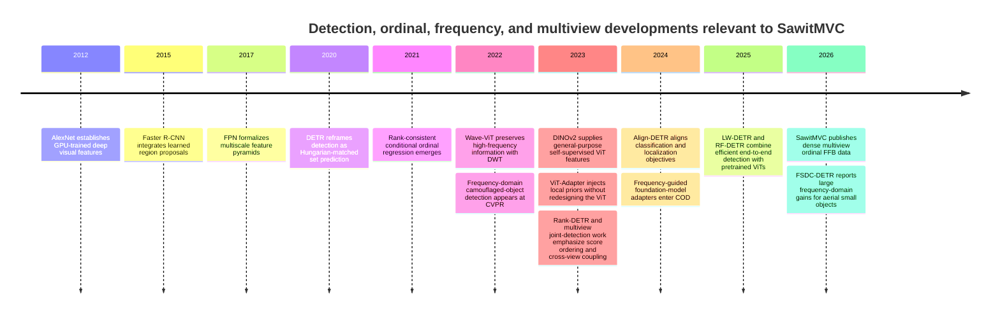
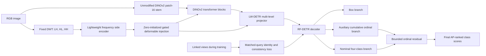

# Breaking the 0.6038 mAP50 Ceiling in Dense Oil-Palm FFB Detection

## Executive assessment

**Frequency-selective side adaptation is the strongest mechanism-specific bet.** The proposed **Frequency-Side-Adapter RF-DETR** leaves the three-channel DINOv2 patch stem unchanged, extracts fixed wavelet high-frequency bands in a parallel branch, and injects them through zero-initialized deformable cross-attention immediately before the LW-DETR multi-scale projector. It targets mechanism **(A), B4 camouflage and missed detection**, with a preregistered expected SawitMVC frozen-test gain of **+0.06 to +0.10 mAP50**, driven by **+0.12 to +0.20 B4 AP50**, but with only medium confidence because the strongest external evidence comes from aerial small-object detection and binary camouflaged-object segmentation rather than ordinal agricultural detection.

**Link-supervised cross-view query consistency is the most novel use of information already present in the dataset.** The proposed **Linked-View Query Consistency** objective uses `_confirmedLinks` to align decoder queries belonging to the same physical bunch, applying identity contrast, ordinal-distribution consistency, and confidence-directed cross-view distillation during training while leaving single-image inference unchanged. It targets mechanism **(B) primarily** and mechanism **(A) secondarily through visible-to-occluded-view transfer**, with an expected SawitMVC frozen-test gain of **+0.05 to +0.09 mAP50** and a required reduction in cross-side inconsistency from **0.2329 to at most 0.18**.

**A bounded ordinal residual head is the lowest-cost way to change loss geometry without repeating the E-017 ranking failure.** The proposed **Ordinal Residual Rank-Preserving Head** retains the detector’s nominal four-class logits, adds a CORN-like cumulative ordinal branch, and permits the ordinal branch to perturb nominal logits only within a bounded margin while a pairwise ranking loss protects the ordering consumed by COCO AP. It targets mechanism **(B), especially B2↔B3**, with an expected SawitMVC frozen-test gain of **+0.05 to +0.08 mAP50**, concentrated in **+0.07 to +0.12 AP50 for B2 and B3**, although the literature does not yet demonstrate a comparably large gain from ordinal constraints in a DETR detector.

The defensible “single general solution” is therefore not one universal mechanism. It is a **mechanism-factorized RF-DETR**, with a frequency branch for discovery, an ordinal branch for grading, and a multiview regularizer for physical-bunch invariance; each component must first clear a separate falsification gate before combination. This conclusion follows directly from the project evidence that B4 non-detection and B2↔B3 ordinal confusion are distinct failure modes, and from the negative evidence against crop classifiers, early fourth-channel fusion, pseudo-depth, contrast enhancement, and generic scaling recipes. fileciteturn0file0

## Formal problem and design requirements

### Dataset-specific formulation

Let \(t\) index trees, \(v\in\mathcal V_t\) index the four to eight photographed sides of tree \(t\), and

\[
x_{tv}\in\mathbb R^{H\times W\times 3}
\]

denote the RGB image from that side. A ground-truth object is

\[
g_{tvj}=(b_{tvj},y_{tvj},u_{tvj}),
\]

where \(b_{tvj}\in[0,1]^4\) is the bounding box, \(y_{tvj}\in\{1,2,3,4\}\) is the ordinal ripeness grade B1–B4, and \(u_{tvj}\) is the physical-bunch identity supplied by the cross-view `_confirmedLinks` graph when the bunch appears in more than one side.

The ceiling under investigation belongs to **SawitMVC RGB**, not SawitMVC-Depth. SawitMVC contains 953 trees, 3,992 images and 18,540 boxes, whereas SawitMVC-Depth is a smaller, lower-density dataset used for the depth and fusion experiments; numerical results between these datasets are not commensurable. The frozen-test reference is RF-DETR-L at **0.6038 mAP50 and 0.2770 mAP50–95**, while the class-agnostic yolo26m comparison on validation reached 0.7191 mAP50 versus 0.5218 for four-class detection, establishing a large grading component without implying that every class is classification-limited. fileciteturn0file0

RF-DETR is documented as a DINOv2-backed, real-time DETR family derived from the LW-DETR design. DINOv2 supplies the pretrained patch representation, while DETR-style one-to-one set prediction avoids NMS; the exact loss implementation should nevertheless be pinned to the project’s installed RF-DETR commit rather than inferred from another detector’s README before any modification is made. citeturn14view11turn13academia36turn1view2

For \(Q\) decoder queries, the detector produces

\[
\mathcal P_{tv}
=
\left\{
\left(
\hat b_{tvi},
z_{tvi1},\ldots,z_{tvi4},
h_{tvi}
\right)
\right\}_{i=1}^{Q},
\]

where \(z_{tvic}\) is the nominal logit for class \(c\), \(h_{tvi}\) is the final decoder embedding, and \(s_{tvic}=f(z_{tvic})\) is the score sorted by `pycocotools` to construct the class-specific precision–recall curve. Hungarian assignment chooses a permutation \(\sigma\) minimizing a criterion of the form

\[
\sigma^\star
=
\arg\min_{\sigma}
\sum_j
\left[
\lambda_{\mathrm{cls}}
C_{\mathrm{cls}}\!\left(z_{\sigma(j)},y_j\right)
+
\lambda_1
\left\|
\hat b_{\sigma(j)}-b_j
\right\|_1
+
\lambda_{\mathrm{giou}}
C_{\mathrm{giou}}\!\left(\hat b_{\sigma(j)},b_j\right)
\right].
\]

Here \(C_{\mathrm{cls}}\) must be taken from the pinned implementation. The recommendations below do not require assuming that it is softmax cross-entropy, independent BCE, varifocal loss, or an IoU-softened target; they attach auxiliary objectives around the existing criterion and specify exactly where the nominal scores may change.

### Why AP ranking is a hard constraint

For each class \(c\), COCO evaluation sorts all detections by \(s_{ic}\). A method can improve argmax grade accuracy yet lower AP when it elevates incorrectly classified neighboring examples above genuine class-\(c\) positives. That is exactly the structural risk exposed by E-017: multiplying independently trained box and crop-classification probabilities damaged global score ranking even when the individual components appeared reasonable. fileciteturn0file0

Let \(R_c\) denote the ordering induced by \(s_{ic}\). The desirable modification is not simply

\[
\Pr(\arg\max_c s_{ic}=y_i)\uparrow,
\]

but

\[
\Pr\!\left(
s_{ic}^{+}>s_{jc}^{-}
\right)\uparrow
\]

for positive–negative detection pairs of class \(c\), while retaining localization quality. Any ordinal mechanism must therefore distinguish between two notions:

\[
\text{ordinal closeness}
\neq
\text{class-specific AP correctness}.
\]

Giving B3 high B2 confidence because the classes are adjacent may improve a \(\pm1\) counting metric but creates a high-scoring B2 false positive under exact-class AP. The proposed ordinal head consequently uses ordinal information to shape representation and resolve close scores, not to replace one-hot evaluation semantics with a smoothed target distribution.

### Mechanism-factorized risk

The empirical task is better represented as two conditional risks:

\[
\mathcal R_A
=
\mathbb E
\left[
\mathbf 1
\left\{
\text{no matched prediction for a visible B4}
\right\}
\right],
\]

\[
\mathcal R_B
=
\mathbb E
\left[
\mathbf 1
\left\{
\hat y\neq y
\right\}
\,\middle|\,
\operatorname{IoU}(\hat b,b)\ge 0.5,\;
y\in\{\mathrm{B2},\mathrm{B3}\}
\right].
\]

Mechanism \(A\) is supported by B4’s very low foreground–background color contrast and its B1-like cross-side class inconsistency despite much poorer detectability. Mechanism \(B\) is supported by the dominance of distance-one confusions and the elevated ambiguity of B2 rather than B4. fileciteturn0file0

The target is therefore a constrained optimization:

\[
\min_\theta
\quad
\mathcal R_{\mathrm{det}}(\theta)
+
\lambda_A\mathcal R_A(\theta)
+
\lambda_B\mathcal R_B(\theta)
+
\lambda_V\mathcal R_{\mathrm{view}}(\theta)
\]

subject to

\[
\Delta\operatorname{mAP50}_{\mathrm{test}}\ge 0.05,
\qquad
\operatorname{mAP50\text{-}95}\ \text{not materially degraded},
\]

\[
I_{\mathrm{cross\text{-}side}}<0.2329,
\qquad
T_{\mathrm{seed}}\le 6\text{ GPU-hours approximately},
\]

and no new annotations, external training images, additional field acquisition, early fourth-channel fusion, or crop-classification stage.

No mathematical proof can guarantee a \(0.05\) empirical mAP improvement on an unknown test distribution. What can be proved are narrower but valuable properties: that the frequency adapter initially reproduces the baseline exactly, that bounded ordinal corrections cannot reverse sufficiently separated score pairs, and that reducing symmetric cross-view divergence bounds disagreement between linked-view predictions.

## Literature map and development timeline

The relevant literature separates into four streams. Detection moved from deep convolutional classification features in 2012, through shared proposal networks and feature pyramids, to DETR’s direct set prediction and modern pretrained-ViT detectors. In parallel, ordinal regression developed rank-consistent cumulative formulations; dense-prediction adapters learned to add local and multiscale priors without replacing pretrained ViT stems; and camouflaged-object research increasingly exploited boundaries and frequency content. citeturn13search0turn15academia12turn15search0turn15academia13turn13academia36

The most relevant primary-source evidence is summarized below. Reported numbers are the authors’ original benchmark results and are **not** predictions for SawitMVC.

| Literature stream | Primary source and identifier | Original reported result | Relevance and transfer limitation |
|---|---|---:|---|
| Ordinal consistency | CORN, arXiv:2111.08851 | Rank-consistent ordinal probabilities through conditional binary tasks | Supplies a valid cumulative parameterization, but was developed for ordinal prediction rather than object-detection AP. citeturn14view6 |
| Detection-score alignment | Align-DETR, arXiv:2304.07527 | 49.3 COCO AP, **+0.6 AP** over its H-DETR R50 baseline; 50.5 AP at 1× and 51.7 at 2× | Shows that classification–localization alignment can improve DETR ranking, but the reported gain is below this project’s approximate 0.05 mAP50 noise threshold. citeturn16view0 |
| Rank-aware DETR | Rank-DETR, arXiv:2310.08854 | Improved H-DETR and DINO-DETR on COCO using rank-oriented architecture, loss and matching | Directly motivates ranking constraints, but it ranks by localization quality rather than ordinal grade structure. citeturn16view1 |
| Wavelet representation | Wave-ViT, arXiv:2207.04978 | Approximately **+1.3 box AP** and **+0.5 mask AP** over its PVT comparison while reducing parameters | Demonstrates that DWT can retain high-frequency detail, but changes the transformer architecture more deeply than is desirable for RF-DETR’s pretrained DINOv2 asset. citeturn14view1 |
| ViT side adaptation | ViT-Adapter, arXiv:2205.08534 | ViT-Adapter-B 49.6 COCO val box AP, **+1.0 over Swin-B**; ViT-Adapter-S gained more than four AP over plain ViT-S in its Mask R-CNN setting | Strong evidence that a parallel spatial branch can add fine detail without replacing the original ViT architecture; its experiments used Mask R-CNN rather than an NMS-free DETR. citeturn16view3turn17academia48 |
| Frequency-domain camouflage | FDCOD, CVPR 2022 | Large improvements on three binary COD benchmarks from explicit DCT-domain enhancement and feature alignment | Mechanistically close to B4, but the task is segmentation of one camouflaged foreground class rather than dense four-grade detection. citeturn13search3 |
| Frequency-guided adapters for COD | Frequency-Guided Spatial Adaptation, arXiv:2409.12421 | Reported superiority over 26 COD methods on four benchmarks | Particularly relevant because it adapts foundation-model features in frequency space, but no exact-class detection AP evidence is supplied. citeturn16view4 |
| Fine-grained ViT adaptation | ViT-Adapter, ICLR 2023 | Adapter modules recover local and multiscale features through sparse deformable interaction | Supports an untouched pretrained stem and zero-initialized feature injection. citeturn17search0 |
| Small-object frequency DETR | FSDC-DETR, arXiv:2607.05176 | **+6.4 AP on VisDrone-DET2019**, **+6.6 on AITODv2**, with **+6.8 and +6.9 AP\(_S\)** | The external effect is large enough to clear the novelty bar, but this is a July 2026 preprint built on a different dual-branch detector and aerial imagery. citeturn14view0 |
| Cross-view joint detection | MVDet, DOI:10.1007/s10044-023-01168-6 | **+16 MODA** over Faster R-CNN and **+25.9 AP** over a separate detection–reidentification combination on MessyTable | Confirms that joint multiview supervision can be large, but uses region proposals and epipolar constraints, both unsuitable as direct imports here. citeturn16view5 |
| Detection calibration | MCCL, arXiv:2306.08271 | Improved multiclass confidence and localization calibration | Optimizes calibration quality, not specifically AP ranking; it does not justify expecting a \(>0.05\) SawitMVC mAP50 gain. citeturn14view9 |
| RF-DETR foundation | RF-DETR, arXiv:2511.09554; ICLR 2026 | DINOv2-backed real-time DETR family with strong COCO performance | This is the correct baseline family to preserve rather than replacing with another off-the-shelf architecture. citeturn0academia41turn14view11 |

The timeline shows why the recommended intervention is an adapter-and-loss extension to RF-DETR rather than a return to proposal crops or generic YOLO scaling.



The historical milestones in the timeline are supported by the original AlexNet, Faster R-CNN, FPN, DETR, DINOv2, ViT-Adapter, and recent frequency-aware DETR publications. citeturn13search0turn15academia12turn15search0turn15academia13turn13academia36turn17academia48turn14view0

## Candidate solution frameworks

The three avenues share the same RF-DETR-L trunk but attach at different points. The design intentionally keeps the DINOv2 RGB patch embedding intact, retains one-to-one prediction, and does not introduce an ROI crop classifier.



### Frequency-Side-Adapter RF-DETR

**Falsification first.** Reject the frequency-side-adapter hypothesis if the three-seed mean improvement on the frozen SawitMVC test split is below **+0.05 mAP50**, if B4 AP50 improves by less than **+0.10**, or if the overall cross-side inconsistency remains above **0.22**. Also reject the proposed implementation if its gain is flat across B1–B4, because a class-flat gain would be more consistent with generic added capacity than with recovery of the measured B4 texture signal.

**Insertion point.** Compute wavelet features directly from the RGB tensor, but do not concatenate them to the RGB stem. Feed them through a narrow side encoder at strides 4, 8 and 16; inject them after approximately one-third and two-thirds of the DINOv2 transformer blocks and again immediately before the LW-DETR projector. The backbone feature is the attention query, while the side feature supplies keys and values, so the semantic representation decides where high-frequency evidence is useful.

For image \(x\), let a one-level orthogonal discrete wavelet transform be

\[
\mathcal W(x)
=
\left(
L,\,
H^{LH},\,
H^{HL},\,
H^{HH}
\right).
\]

Only the high-frequency components are sent to the side branch:

\[
H(x)
=
\operatorname{concat}
\left[
H^{LH},H^{HL},H^{HH}
\right].
\]

At injection level \(\ell\),

\[
G_\ell
=
E_\ell(H(x)),
\]

\[
A_\ell
=
\operatorname{DeformAttn}
\left(
Q=F_\ell W_Q,\,
K=G_\ell W_K,\,
V=G_\ell W_V
\right),
\]

\[
F_\ell'
=
F_\ell
+
\gamma_\ell
\,
g_\ell(F_\ell,G_\ell)
\odot
A_\ell,
\]

where \(F_\ell\) is the native DINOv2 or projector feature, \(\gamma_\ell\) is a learned scalar initialized to zero, and

\[
g_\ell
=
\sigma
\left(
\operatorname{MLP}
\left[
\operatorname{LN}(F_\ell);
\operatorname{LN}(G_\ell)
\right]
\right)
\]

is a spatial-channel gate. Each side feature is energy-normalized,

\[
\bar G_\ell
=
\frac{G_\ell}
{\sqrt{\mathbb E[G_\ell^2]+\varepsilon}},
\]

to prevent illumination-dependent edge magnitude from dominating the pretrained representation.

A box-derived center target can train a small side-branch objectness probe without masks or reannotation. For box \(b_j\), place a Gaussian \(M_j(p)\) at its center with scale determined by box dimensions, define

\[
M(p)=\max_j M_j(p),
\]

and train

\[
\mathcal L_{\mathrm{freq\text{-}ctr}}
=
-\sum_p
\begin{cases}
(1-\hat M_p)^\alpha\log\hat M_p, & M(p)=1,\\[3pt]
(1-M(p))^\beta \hat M_p^\alpha\log(1-\hat M_p), & \text{otherwise}.
\end{cases}
\]

This head is training-only; it is not a second detector and does not generate ROI crops. Its purpose is to force the high-frequency branch to distinguish object-centered structure from abundant frond edges.

The complete mechanism-\(A\) loss is

\[
\mathcal L_A
=
\mathcal L_{\mathrm{base}}
+
\lambda_{\mathrm{ctr}}\mathcal L_{\mathrm{freq\text{-}ctr}}
+
\lambda_g
\sum_\ell
\|g_\ell\|_1
+
\lambda_\gamma
\sum_\ell \gamma_\ell^2.
\]

The sparse gate regularizer matters because canopy imagery contains many irrelevant high-frequency responses from leaf boundaries. FSDC-DETR similarly argues that indiscriminately propagating frequency components can retain background noise, and consequently uses adaptive frequency–spatial selection rather than raw high-pass concatenation. citeturn14view0

**Baseline-preservation proposition.** If \(\gamma_\ell=0\) at every insertion level, then

\[
F_\ell'=F_\ell
\]

for every input and layer. Therefore, at initialization the modified network computes exactly the same backbone, projector, decoder, box outputs and nominal class scores as the original RF-DETR-L.

**Proof.** Substitute \(\gamma_\ell=0\) into each residual injection. Every side contribution vanishes, so induction over the sequence of backbone and projector blocks gives equality with the baseline at every downstream layer. The DINOv2 stem is neither structurally modified nor required to absorb a randomly initialized fourth-channel kernel.

This directly addresses the E-030 objection. The model does not alter the pretrained three-channel stem, and a useless side branch begins as a no-op rather than as an unavoidable source of noise.

**Effect on AP ranking.** The frequency branch does not apply post-hoc multiplication or class-score averaging. It changes the shared representation before the native joint class and box branches, allowing box confidence and class confidence to remain jointly trained under the detector’s existing matching and scoring criterion. The risk is not ranking destruction but false activation on frond texture; the gate penalty, center supervision, and class-specific B4 outcome gate are designed to detect that failure.

The design is supported by three independent literature signals. Wave-ViT showed that wavelet decomposition can preserve high-frequency information lost by ordinary token reduction; ViT-Adapter showed that local and multiscale image priors can be injected through a side architecture without replacing the plain ViT; and frequency-based COD methods show that spectral clues can separate low-contrast foregrounds from visually similar backgrounds. citeturn14view1turn17academia48turn13search3turn16view4

The unusually large external result is FSDC-DETR’s reported +6.4 and +6.6 AP on VisDrone-DET2019 and AITODv2, including +6.8 and +6.9 AP for small objects. That result makes a \(>0.05\) SawitMVC mAP50 effect plausible enough to test, but it is a 2026 preprint and its aerial scenes, baseline detector, object scales and dual-branch architecture differ materially from oil-palm canopies. citeturn14view0

**Predicted SawitMVC frozen-test effects.**

| Class | Predicted AP50 change | Mechanistic expectation |
|---|---:|---|
| B1 | \(0.00\) to \(+0.02\) | Already visually salient; little benefit expected. |
| B2 | \(0.00\) to \(+0.02\) | Texture branch does not directly resolve ordinal ambiguity. |
| B3 | \(+0.02\) to \(+0.05\) | Some benefit from preserving fruitlet texture, but less than B4. |
| B4 | **\(+0.12\) to \(+0.20\)** | Principal target: green-on-green discovery and small embedded structure. |
| Overall mAP50 | **\(+0.06\) to \(+0.10\)** | Expected only if B4 gains are large and false frond activations remain controlled. |
| Cross-side inconsistency | \(0.2329\rightarrow0.18\)–\(0.20\) | Improvement should be largest for linked B4 instances. |

The proposed three-seed cost is approximately **5.0–5.8 GPU-hours per seed**, or **15–17.4 RTX A4500 GPU-hours total**, using mixed precision, gradient checkpointing in the DINOv2 trunk, a side width no greater than one-quarter of the projector width, and only two backbone injections. A four-stage ViT-Adapter reproduction is not recommended under the available VRAM; it would add too many dense interaction maps and would test the literature architecture rather than the B4-specific hypothesis.

A compact implementation sketch is:

```python
rgb_tokens = dinov2.patch_embed(rgb)          # unchanged pretrained stem
high = fixed_dwt_highbands(rgb)               # LH, HL, HH; no RGB concatenation
side = frequency_side_encoder(high)            # P2/P3/P4-style features

for block_idx, block in enumerate(dinov2.blocks):
    rgb_tokens = block(rgb_tokens)

    if block_idx in injection_blocks:
        delta = deformable_cross_attention(
            query=rgb_tokens,
            key=side[block_idx],
            value=side[block_idx],
        )
        gate = sigmoid(gate_mlp(rgb_tokens, side[block_idx]))
        rgb_tokens = rgb_tokens + gamma[block_idx] * gate * delta

features = lw_detr_projector(rgb_tokens, side_adapter=side)
outputs = rf_detr_decoder(features)
```

### Linked-View Query Consistency

**Falsification first.** Reject the multiview mechanism if the three-seed frozen-test gain is below **+0.05 mAP50**, if overall cross-side inconsistency does not fall below **0.19**, or if the B2/B3 inconsistency and adjacent-confusion rates remain materially unchanged. A gain in mAP with inconsistency still near 0.2329 must be reported as generic regularization or additional effective batch structure, not as successful exploitation of physical-bunch identity.

**Insertion point.** All views pass independently through the same RF-DETR-L. After Hungarian matching, collect the final decoder embeddings and auxiliary ordinal predictions of the queries matched to linked ground-truth boxes; apply link losses after the last two decoder layers during training only. There is no image warping, homography, 3D reconstruction, epipolar filtering, feature mosaic, or multiview inference dependency.

For physical bunch \(u\) visible in views \(v,w\), let

\[
i(u,v)=\sigma_{tv}^{\star}(j_{uv})
\]

be the query matched to that view’s ground-truth box, and let

\[
e_{uv}
=
\frac{\psi(h_{tvi(u,v)})}
{\|\psi(h_{tvi(u,v)})\|_2}
\]

be a normalized projection of its decoder representation. A supervised cross-view contrastive loss is

\[
\mathcal L_{\mathrm{id}}
=
-
\sum_{(u,v,w)}
\log
\frac{
\exp(e_{uv}^{\top}e_{uw}/\tau)
}{
\exp(e_{uv}^{\top}e_{uw}/\tau)
+
\sum_{u'\neq u}
\exp(e_{uv}^{\top}e_{u'w}/\tau)
}.
\]

Negatives should come from other physical bunches in the same tree where possible. This prevents the model from solving identity merely through tree-level illumination, background or acquisition-side cues.

Let \(\pi_{uv}\in\Delta^3\) be the ordinal probability distribution produced by the auxiliary head defined in the next avenue. Cross-view grade consistency is

\[
\mathcal L_{\mathrm{JS}}
=
\sum_{(u,v,w)}
\operatorname{JS}
\left(
\pi_{uv}\,\|\,\pi_{uw}
\right).
\]

Because one side may be clearer than another, use confidence-directed distillation. Define

\[
r_{uv}
=
\eta_1
\frac{\operatorname{area}(b_{uv})}
{\operatorname{area}(x_{tv})}
-
\eta_2 H(\pi_{uv})
+
\eta_3 q_{uv},
\]

where \(q_{uv}\) is the native matched-query quality estimate available from the detector, or zero if the pinned implementation has no explicit quality score. For \(r_{uv}>r_{uw}\),

\[
\mathcal L_{\mathrm{teach}}
=
D_{\mathrm{KL}}
\left(
\operatorname{stopgrad}(\pi_{uv})
\;\middle\|\;
\pi_{uw}
\right),
\]

with the direction reversed when \(w\) is more reliable.

To transfer discovery evidence to difficult views, apply consistency to matched query objectness \(o_{uv}\) while retaining ordinary per-view ground-truth supervision:

\[
\mathcal L_{\mathrm{presence}}
=
\sum_{(u,v)}
\omega_{uv}
\left[
\delta-o_{uv}
\right]_+,
\]

where \(\omega_{uv}\) is lower for extremely small boxes. This term does not allow one easy side to excuse a miss on another side; every annotated view remains a supervised visible instance.

The multiview objective is

\[
\mathcal L_V
=
\mathcal L_{\mathrm{base}}
+
\lambda_{\mathrm{id}}\mathcal L_{\mathrm{id}}
+
\lambda_{\mathrm{JS}}\mathcal L_{\mathrm{JS}}
+
\lambda_{\mathrm{teach}}\mathcal L_{\mathrm{teach}}
+
\lambda_{\mathrm{presence}}\mathcal L_{\mathrm{presence}}.
\]

**Consistency-bound proposition.** For linked-view ordinal distributions \(p\) and \(q\),

\[
\operatorname{TV}(p,q)
\le
\sqrt{
\frac{1}{2}
D_{\mathrm{KL}}(p\|q)
}.
\]

Thus reducing bidirectional KL or Jensen–Shannon divergence bounds the total-variation discrepancy between linked-view grade distributions.

**Proof.** The inequality is Pinsker’s inequality. Applying it in both directions, or through the mixture distribution used by Jensen–Shannon divergence, shows that small consistency loss implies small distributional disagreement. It does not prove identical argmax classes or improved AP, but it provides a rigorous mechanism-level connection to the measured inconsistency probe.

**Effect on AP ranking.** The multiview distributions are not averaged at test time. The losses alter query representations during training, while each image retains a single jointly trained RF-DETR score at inference. To guard against excessive score compression, add an intra-batch pairwise detector-ranking loss

\[
\mathcal L_{\mathrm{pair}}
=
\sum_c
\sum_{(i,j)\in\mathcal P_c}
\log
\left[
1+\exp\left(
-\left(z_{ic}-z_{jc}\right)
\right)
\right],
\]

where \(i\) is a matched positive of class \(c\) and \(j\) is a hard unmatched or wrong-class query. This explicitly rewards the positive-over-negative ordering consumed by AP.

MVDet’s large MessyTable result establishes that jointly optimized multiview detection and identity reasoning can substantially outperform independently trained view processing. Its epipolar geometry and proposal-based ReID path are not imported here: adjacent oil-palm views are wide-baseline, non-simultaneous, partially occluded and potentially affected by canopy motion, while MVDet relies on proposal features and epipolar constraints. citeturn16view5

That negative transfer lesson is important. The proposed method uses the dataset’s identity graph as **supervision**, not as an assumption that pixels can be geometrically aligned.

**Predicted SawitMVC frozen-test effects.**

| Class | Predicted AP50 change | Mechanistic expectation |
|---|---:|---|
| B1 | \(+0.01\) to \(+0.04\) | Stable class; modest representation regularization. |
| B2 | **\(+0.06\) to \(+0.10\)** | Clearer linked sides supervise ambiguous sides. |
| B3 | **\(+0.06\) to \(+0.11\)** | Same benefit, potentially larger because B3 is intermediate and less frequent. |
| B4 | \(+0.03\) to \(+0.07\) | Secondary benefit when another view exposes texture or contour; not a substitute for the frequency branch. |
| Overall mAP50 | **\(+0.05\) to \(+0.09\)** | Requires a strong B2/B3 gain without flattening class scores. |
| Cross-side inconsistency | **\(0.2329\rightarrow0.15\)–\(0.18\)** | Primary success criterion. |

The estimated cost is **5.3–6.0 GPU-hours per seed**, or **15.9–18 GPU-hours total**, provided each batch contains one linked pair plus ordinary single images rather than all four to eight sides simultaneously. Decoder embeddings can be cached only within the current gradient step; stale offline embeddings would weaken end-to-end coupling.

```python
outputs_a = model(view_a)
outputs_b = model(view_b)

match_a = hungarian_match(outputs_a, targets_a)
match_b = hungarian_match(outputs_b, targets_b)

pairs = collect_confirmed_link_queries(
    outputs_a, outputs_b, match_a, match_b, confirmed_links
)

loss = base_detection_loss(outputs_a, targets_a)
loss += base_detection_loss(outputs_b, targets_b)
loss += lambda_id * linked_identity_contrast(pairs)
loss += lambda_js * linked_ordinal_js(pairs)
loss += lambda_teacher * confidence_directed_distillation(pairs)
loss += lambda_rank * positive_negative_pair_ranking(outputs_a, outputs_b)
```

### Ordinal Residual Rank-Preserving Head

**Falsification first.** Reject the ordinal-head hypothesis if the three-seed SawitMVC frozen-test improvement is below **+0.05 mAP50**, if mean B2/B3 AP50 does not improve by at least **+0.07**, or if B1 or B4 AP50 declines by more than **0.02**. Also reject a configuration that improves \(\pm1\) grade accuracy while lowering exact-grade mAP50; such a result would validate the project’s concern about label-distribution smoothing rather than solve it.

**Insertion point.** Keep the existing box branch and nominal four-class branch unchanged. From the final two decoder layers, add three cumulative ordinal logits per query; convert them into a proper four-grade distribution, then permit a gated and bounded residual correction to the nominal class logits.

For a matched query \(i\), predict

\[
q_{ik}
=
P(Y>k\mid h_i)
=
\sigma(a_{ik}),
\qquad
k\in\{1,2,3\}.
\]

The cumulative targets are

\[
t_{ik}
=
\mathbf 1[y_i>k].
\]

The conditional ordinal loss is

\[
\mathcal L_{\mathrm{ord}}
=
-
\sum_i
\sum_{k=1}^{3}
w_{y_i}
\left[
t_{ik}\log q_{ik}
+
(1-t_{ik})\log(1-q_{ik})
\right].
\]

A class-balanced weight can be defined using the effective number of samples,

\[
w_c
=
\frac{1-\beta}
{1-\beta^{n_c}},
\]

but it should be applied only to matched ordinal examples in the first experiment. Combining focal reweighting, class balancing and ordinal geometry in one run would make attribution impossible.

Using a CORN-style conditional construction, define

\[
\pi_{i1}=1-q_{i1},
\]

\[
\pi_{i2}=q_{i1}(1-q_{i2}),
\]

\[
\pi_{i3}=q_{i1}q_{i2}(1-q_{i3}),
\]

\[
\pi_{i4}=q_{i1}q_{i2}q_{i3}.
\]

These probabilities are nonnegative and sum to one. They encode the grade continuum without assigning neighbor confidence directly to the nominal AP score.

Let \(z_{ic}\) be the native class logit. Define a centered ordinal residual

\[
r_{ic}
=
\log(\pi_{ic}+\epsilon)
-
\frac{1}{4}
\sum_{d=1}^{4}
\log(\pi_{id}+\epsilon),
\]

and a gated, clipped correction

\[
\delta_{ic}
=
\operatorname{clip}
\left(
\alpha_c
\sigma(g_i)
r_{ic},
-\varepsilon_c,
+\varepsilon_c
\right).
\]

The final score logit is

\[
\tilde z_{ic}
=
z_{ic}+\delta_{ic}.
\]

Initialize \(\alpha_c=0\), so the model begins as the RF-DETR baseline. The clipping radius \(\varepsilon_c\) should initially be common across classes and tuned only on validation; a plausible starting range is \(0.15\)–\(0.30\) logit units.

**Ranking-preservation proposition.** Consider two detections \(i,j\) for class \(c\). If

\[
z_{ic}-z_{jc}>2\varepsilon_c
\]

and

\[
|\delta_{ic}|\le\varepsilon_c,\qquad
|\delta_{jc}|\le\varepsilon_c,
\]

then

\[
\tilde z_{ic}>\tilde z_{jc}.
\]

**Proof.**

\[
\tilde z_{ic}-\tilde z_{jc}
=
(z_{ic}-z_{jc})
+
(\delta_{ic}-\delta_{jc}).
\]

The worst possible residual difference is

\[
\delta_{ic}-\delta_{jc}\ge-2\varepsilon_c.
\]

Therefore,

\[
\tilde z_{ic}-\tilde z_{jc}
>
2\varepsilon_c-2\varepsilon_c
=0.
\]

Hence any baseline ordering separated by more than \(2\varepsilon_c\) is preserved. Only close-score pairs—precisely those most plausibly representing ambiguous B2/B3 cases—can be reordered.

To push those close pairs in an AP-compatible direction, add

\[
\mathcal L_{\mathrm{rank}}
=
\sum_c
\sum_{(i,j)\in\mathcal P_c}
\log
\left[
1+
\exp
\left(
-\left(\tilde z_{ic}-\tilde z_{jc}\right)
\right)
\right],
\]

where \(\mathcal P_c\) pairs a matched class-\(c\) positive with a hard negative or adjacent-grade matched query that currently scores too highly as class \(c\). The full mechanism-\(B\) loss is

\[
\mathcal L_B
=
\mathcal L_{\mathrm{base}}
+
\lambda_{\mathrm{ord}}\mathcal L_{\mathrm{ord}}
+
\lambda_{\mathrm{rank}}\mathcal L_{\mathrm{rank}}
+
\lambda_\delta
\sum_{i,c}\delta_{ic}^2.
\]

The gradient of the cumulative ordinal loss naturally reflects ordinal distance. Misclassifying B1 as B4 violates three thresholds, whereas confusing B2 with B3 violates one; consequently a distant error receives gradients through more cumulative terms without assigning a softened B1 target to B2 or B3. CORN supplies the conditional-probability foundation, while Rank-DETR and Align-DETR establish that matching and loss geometry should be designed around the ranking behavior of DETR outputs rather than classification accuracy alone. citeturn14view6turn16view1turn16view0

The external evidence does **not** establish a \(+0.05\) detector gain from ordinal regression. Align-DETR’s headline improvement over its stated baseline was +0.6 COCO AP, and Rank-DETR addresses localization-quality ordering, so the larger expected SawitMVC effect rests on unusually strong project-specific evidence: the labels represent thresholds on one maturation continuum and the dominant errors are adjacent. citeturn16view0turn16view1turn0file0

**Predicted SawitMVC frozen-test effects.**

| Class | Predicted AP50 change | Mechanistic expectation |
|---|---:|---|
| B1 | \(-0.01\) to \(+0.02\) | Strong endpoint; clipping should protect existing ranking. |
| B2 | **\(+0.07\) to \(+0.12\)** | Primary target; one-sided cumulative constraints reduce incoherent grade scores. |
| B3 | **\(+0.07\) to \(+0.12\)** | Primary target; benefits from rank-consistent thresholds and class balancing. |
| B4 | \(-0.01\) to \(+0.02\) | Ordinal geometry cannot recover undetected objects. |
| Overall mAP50 | **\(+0.05\) to \(+0.08\)** | Requires middle-class gains without endpoint leakage. |
| Cross-side inconsistency | \(0.2329\rightarrow0.19\)–\(0.21\) | Reduction should occur mainly for linked B2/B3 predictions. |

The estimated cost is **4.0–4.8 GPU-hours per seed**, or **12–14.4 GPU-hours total**. The added head is negligible in memory; most additional cost comes from hard-pair construction and potentially slower convergence from the auxiliary objectives.

```python
decoder_h = outputs["decoder_hidden"]
nominal_logits = outputs["pred_logits"]        # retain native branch

ordinal_logits = ordinal_head(decoder_h)       # three cumulative logits
ordinal_probs = cumulative_to_four_classes(ordinal_logits)

residual = centered_log_probability(ordinal_probs)
residual = gate(decoder_h) * residual
residual = residual.clamp(-eps, eps)

final_logits = nominal_logits + alpha * residual

loss = native_rf_detr_loss(outputs, targets)
loss += lambda_ord * cumulative_ordinal_loss(ordinal_logits, targets)
loss += lambda_rank * hard_pair_ap_ranking_loss(final_logits, assignments)
loss += lambda_res * residual.square().mean()
```

## Comparative ranking and validation

### Ranked avenues

The ranking below is by expected gain divided by estimated GPU cost, then by whether the auxiliary probe can clearly falsify the claimed mechanism. All effect sizes are preregistration hypotheses on the **SawitMVC frozen test split**, not results.

| Rank | Avenue | Target | Expected \(\Delta\) test mAP50 | Principal per-class prediction | Three-seed GPU cost | Implementation risk | Confidence |
|---:|---|---|---:|---|---:|---|---|
| 1 | Ordinal Residual Rank-Preserving Head | B | \(+0.05\) to \(+0.08\) | B2/B3 \(+0.07\) to \(+0.12\) each | 12–14.4 h | Medium | Low–medium |
| 2 | Frequency-Side-Adapter RF-DETR | A | \(+0.06\) to \(+0.10\) | B4 \(+0.12\) to \(+0.20\) | 15–17.4 h | Medium–high | Medium |
| 3 | Linked-View Query Consistency | B primary; A secondary | \(+0.05\) to \(+0.09\) | B2/B3 \(+0.06\) to \(+0.11\); B4 \(+0.03\) to \(+0.07\) | 15.9–18 h | High | Medium |
| Diagnostic only | Per-class isotonic or AP-aware calibration | Score ordering | Uncertain; likely \(<+0.05\) | No reliable class-specific prediction | <1 h | Low | Low |
| Not recommended as a standalone run | Generic P2/BiFPN neck | Small detail | Likely \(+0.01\) to \(+0.04\) | Broad, not B4-specific | 14–18 h | Medium | Low |
| Not recommended | Full geometry-based multiview fusion | Cross-view | Unknown | Highly dependent on overlap | Above budget | Very high | Very low |

The ordinal head ranks first on gain per GPU-hour, not on expected absolute gain. The frequency adapter is the strongest mechanism-\(A\) proposal and has the most encouraging external effect sizes. Linked-view consistency has the best auxiliary falsification signal but the highest data-loader and implementation complexity.

### Experimental design

**Commit and baseline lock.** Pin the exact RF-DETR-L source commit, pretrained checkpoint, package versions, image normalization, resolution, augmentation, optimizer, scheduler, Hungarian-cost weights and native criterion. Before modifying the model, reproduce the **0.6038 test mAP50 / 0.2770 test mAP50–95** baseline or document the deviation; do not compare a newly reproduced baseline using a different evaluator with the historical result. fileciteturn0file0

**Development versus test.** Select hyperparameters on the existing validation split. Keep the test split frozen until one architecture and one hyperparameter setting per avenue has been selected, then evaluate all three seeds on test with `pycocotools`. Every result must be labeled `SawitMVC-val` or `SawitMVC-test`; SawitMVC-Depth results must remain in a separate table.

**Seed design.** Use three predetermined seeds shared across baseline and treatment. The strongest design trains paired baseline and treatment runs from the same seed and data ordering so the comparison is not inflated by independent seed variance. The depth-track seed range of 0.0321 and split range of 0.0488 are conservative proxies rather than measured RF-DETR-L RGB variance, so paired inference is more informative than simply asking whether an unpaired confidence interval excludes zero. fileciteturn0file0

**Tree-level bootstrap.** Images from the same tree and linked views of the same physical bunch are correlated. Resample trees, not images, in a paired bootstrap:

\[
\Delta^{(r)}
=
M
\left(
\mathcal D^{(r)};
\theta_{\mathrm{new}}
\right)
-
M
\left(
\mathcal D^{(r)};
\theta_{\mathrm{base}}
\right),
\]

where \(\mathcal D^{(r)}\) is a bootstrap sample of trees and \(M\) is `pycocotools` mAP. Use at least 10,000 bootstrap replicates to report percentile and bias-corrected 95% intervals for overall mAP50, mAP50–95 and each class AP50.

**Primary decision rule.** An avenue passes only when all of the following hold:

\[
\overline{\Delta\operatorname{mAP50}_{\mathrm{test}}}\ge0.05,
\]

the tree-bootstrap 95% interval is predominantly positive,

\[
\overline{\Delta\operatorname{mAP50\text{-}95}}\ge-0.01,
\]

and the avenue-specific class and inconsistency gate is met. A point estimate of \(+0.05\) with a broad interval crossing a material negative effect is an indication, not a finding.

**Auxiliary mechanism probe.** Recompute cross-side inconsistency on the same confirmed-link protocol used by E-028, reporting overall and B1/B2/B3/B4 values. Frequency adaptation must primarily improve B4 consistency through increased successful discovery; ordinal adaptation must primarily improve B2/B3 consistency; linked-view training must yield the largest overall drop. The baseline is 0.2329 over 511 physical bunches under the existing probe. fileciteturn0file0

**Ranking diagnostics.** For each class, save every scored prediction and report:

\[
P_c
=
\Pr(s_c^+>s_c^-),
\]

the fraction of positive–hard-negative pairs correctly ordered;

\[
N_c^{\mathrm{adj}}
=
\Pr
\left(
s_{c'}>s_c
\mid
y=c,\ |c-c'|=1
\right),
\]

the adjacent-class rank error; and the score change on existing true positives versus new detections. This distinguishes a genuine B4 recall gain from score calibration and distinguishes an ordinal ranking gain from target smoothing.

**Counting endpoint.** Re-run both exact-grade and \(\pm1\)-tolerant counting evaluations. Because the published counting system falls from 96.81% with ground-truth boxes to 75.35% with detector boxes, frequency-side improvements should improve both exact and tolerant counting; ordinal loss may improve tolerant counting more than exact mAP, which must be disclosed rather than averaged into one success claim. fileciteturn0file0

**Ablation order.** For every avenue, use one baseline and at most three principled ablations:

| Avenue | Required ablations |
|---|---|
| Frequency adapter | High-frequency branch with zero-init gating; same-parameter low-frequency branch; shuffled-frequency or phase-randomized control |
| Linked-view consistency | Identity contrast only; ordinal consistency only; full confidence-directed objective |
| Ordinal head | Auxiliary ordinal loss without logit residual; residual without rank loss; full bounded residual plus rank loss |

The same-parameter controls are essential. In particular, a frequency branch must beat a low-frequency or phase-randomized branch to demonstrate that the measured Laplacian/Sobel signal—not merely extra parameters—causes the gain.

## What the search did not support

**No post-hoc calibration method found justifies a \(>0.05\) AP prediction.** The recent detection-calibration literature focuses mainly on confidence and localization calibration error, risk estimation, or coverage guarantees. These are useful deployment properties, but calibration error and AP are different objectives: a monotone per-class transform leaves within-class AP ordering unchanged, while a non-monotone transform can alter AP but risks validation overfit. MCCL is relevant to confidence–localization calibration, yet it does not provide evidence that a fixed detector’s mAP can be raised by five points through a cheap calibration pass. citeturn14view9

I-17 should still be run because it is nearly free, but it should be framed as a diagnostic. Per-class isotonic regression can reveal whether severe score-order distortion exists, and stratification by class, box size and image density may identify deployment thresholds; it should not displace the three architecture-and-loss experiments.

**No 2022–2026 paper was found that directly solves ordinal DETR classification while proving exact-class AP ranking preservation.** CORN and related cumulative methods produce coherent ordinal probabilities, while Rank-DETR and Align-DETR address detector ranking and classification–localization alignment. The proposed bounded-residual construction is a synthesis of these ideas, not a published plug-in with an established oil-palm benchmark result. citeturn14view6turn16view1turn16view0

**Dedicated COD literature is overwhelmingly segmentation-centric.** Frequency-domain COD, FSPNet-style locality and pyramid reasoning, edge reconstruction, uncertainty refinement and frequency-guided adapters are all relevant to representation design, but they predict binary masks on curated camouflage datasets. Their apparent success cannot be transferred numerically to dense bounding-box detection with four ordinal grades, repeated instances, heavy self-occlusion and uncontrolled canopy backgrounds. FDCOD explicitly motivates frequency as an additional clue for objects embedded in their surroundings, but its architecture and objective do not preserve a four-class detector’s AP ranking. citeturn13search3turn7search3turn7search15turn16view4

**No suitable narrow-baseline geometric multiview method was found for the acquisition regime.** Most multiview detection systems assume calibrated cameras, synchronized observations, sufficient overlap, a ground plane, epipolar compatibility or recoverable 3D correspondence. SawitMVC’s roughly orthogonal sides, moving foliage, self-occlusion and limited common image content make those assumptions high-risk, even though MVDet demonstrates that multiview joint optimization can be powerful in a controlled multi-camera scene. citeturn16view5

**A plain P2 feature level or BiFPN does not meet the novelty and effect-size bar by itself.** FPN and BiFPN are established generic multiscale mechanisms, and external improvements from ordinary pyramid replacements are generally much smaller than the frequency-aware small-object gains reported by FSDC-DETR. A P2 pathway is valuable only as part of the class-mechanistic frequency adapter, where it carries measured high-frequency B4 evidence rather than simply increasing feature resolution. citeturn15search0turn15search8turn14view0

**No published oil-palm FFB method found in the search matches this exact problem formulation.** Recent FFB work includes standard YOLO-family detection, crop-level ripeness classification, engineered color indices, and additional sensing modalities. Those approaches either repeat already exhausted detector recipes, use the E-017-style crop formulation, or require external modalities and data outside the stated budget; none was found to combine dense single-stage DETR detection, ordinal ranking, cross-side identity supervision and frequency-side adaptation. citeturn10search0turn10search2turn10search11

**Depth, HHA and normals remain scientifically open but are not priority experiments here.** Mid-fusion depth was only indicative on the small SawitMVC-Depth experiments, while early fusion was harmful and the high-capacity depth conclusion was withdrawn. Even a well-designed late depth adapter would be evaluated on a different dataset and mAP scale, so it cannot directly break the 0.6038 SawitMVC RGB ceiling. fileciteturn0file0

## Recommended synthesis, limitations, and open problems

### Final mechanism-factorized solution

The recommended final architecture is **MF-RF-DETR: Mechanism-Factorized RF-DETR**, defined by

\[
\mathcal L_{\mathrm{MF}}
=
\mathcal L_{\mathrm{RF}}
+
\lambda_A
\left(
\mathcal L_{\mathrm{freq\text{-}ctr}}
+
\lambda_g\mathcal L_{\mathrm{gate}}
\right)
+
\lambda_B
\left(
\mathcal L_{\mathrm{ord}}
+
\lambda_r\mathcal L_{\mathrm{rank}}
+
\lambda_\delta\mathcal L_{\mathrm{res}}
\right)
+
\lambda_V
\left(
\mathcal L_{\mathrm{id}}
+
\mathcal L_{\mathrm{JS}}
+
\mathcal L_{\mathrm{teach}}
\right).
\]

Its inference graph remains one-stage:

\[
x
\longrightarrow
\text{RGB DINOv2 trunk plus gated frequency adapter}
\longrightarrow
\text{LW-DETR projector}
\longrightarrow
\text{decoder}
\longrightarrow
\{\hat b_i,\tilde s_{ic}\}_{i,c}.
\]

There is no crop classifier, NMS, multiview geometric reconstruction, depth input, test-time tiling, or post-hoc multiplication of independently trained probabilities.

The components should not be trained together initially. The scientifically efficient sequence is:

| Stage | Run | Advancement gate |
|---|---|---|
| Ordinal geometry | Three-seed ordinal residual head | \(+0.05\) test mAP50; B2/B3 mean \(+0.07\); endpoints protected |
| Frequency discovery | Three-seed frequency-side adapter | \(+0.05\) test mAP50; B4 \(+0.10\); inconsistency \(<0.22\) |
| View invariance | Three-seed linked-view consistency | \(+0.05\) test mAP50; inconsistency \(<0.19\) |
| Pairwise combinations | Combine only components that passed | Combination must beat the stronger constituent by \(+0.025\), not merely match it |
| Final MF-RF-DETR | Three-seed full model only if at least two components pass | \(+0.09\) test mAP50 and no material mAP50–95 loss |

The full model’s preregistered, non-additive expectation is

\[
\Delta\operatorname{mAP50}_{\mathrm{test}}
=
+0.09\text{ to }+0.14,
\]

which would place the point estimate near

\[
0.694\text{ to }0.744.
\]

The expected cross-side inconsistency is

\[
0.14\text{ to }0.18.
\]

These are research hypotheses, not literature-backed guarantees. Component improvements will overlap: linked-view consistency and the ordinal head both affect B2/B3, while multiview transfer may partially overlap with B4 frequency adaptation.

### Why this is the best general solution

The architecture is mathematically and empirically aligned with the known failure decomposition:

\[
\underbrace{\text{frequency-side evidence}}_{\text{find B4}}
\quad+\quad
\underbrace{\text{bounded ordinal geometry}}_{\text{grade B2/B3}}
\quad+\quad
\underbrace{\text{identity consistency}}_{\text{same physical bunch across sides}}.
\]

It also preserves the asset that produced the current SOTA: the pretrained DINOv2 RGB pathway in an NMS-free DETR. RF-DETR’s use of DINOv2 and LW-DETR-style efficient set prediction makes feature-side adaptation preferable to replacing the backbone or altering the patch stem. citeturn14view11turn13academia36turn1view2

The solution contains three rigorous safeguards against previously observed failure modes. Zero-initialized frequency injection makes the baseline an exact initial submodel; bounded ordinal residuals preserve all class-score pair orderings with margins exceeding twice the residual radius; and linked-view Jensen–Shannon or KL consistency has a formal upper-bound relationship to distributional disagreement.

### Limitations

The largest uncertainty is domain transfer. FSDC-DETR’s six-point gains come from aerial small-object benchmarks, COD results come mainly from binary segmentation, ViT-Adapter results come largely from Mask R-CNN-based dense prediction, and MVDet uses controlled multi-camera geometry. None reproduces the combination of tropical illumination, dense fronds, ordinal grades, smartphone viewpoints, repeated physical bunches and annotation tightness present in SawitMVC. citeturn14view0turn13search3turn16view3turn16view5

The annotation ceiling remains binding. E-018 estimated a validation ceiling of 0.8834 mAP50 but only 0.4702 mAP50–95, with median best IoU 0.7303; therefore a substantial mAP50 gain may coexist with modest mAP50–95 progress, especially if the interventions improve discovery and grading more than box tightness. The validation ceiling must not be numerically treated as a test-set ceiling. fileciteturn0file0

The ordinal classes may not be fully recoverable from every individual image. The field guide defines B2 and B3 largely by their ordering on a maturation continuum rather than by independent visual criteria, so a model can be mathematically rank-consistent yet still lack enough photometric evidence in severely shaded views. Multiview training reduces that problem only when at least one linked side is informative.

The identity graph can also induce bias. Bunches appearing in multiple views may be larger, more exposed or differently distributed from single-view bunches; link-based training must therefore retain ordinary single-image batches and report metrics separately for linked and unlinked instances.

Finally, the exact RF-DETR criterion is an implementation dependency. The nominal classification score, auxiliary decoder losses and Hungarian matching cost must be inspected in the pinned project version before inserting the ordinal residual; otherwise a mathematically sound head could be attached to the wrong score path.

### Open research problems

The central theoretical problem is an AP-consistent ordinal set-prediction loss. Existing ordinal methods optimize threshold likelihood or rank consistency, while detector ranking methods primarily align confidence with localization quality. A unified surrogate should simultaneously be calibrated for the four ordered grades, Fisher-consistent for class-specific ranking, and compatible with Hungarian assignment.

A second open problem is frequency selectivity under structured clutter. Palm fronds generate strong edges, so “more high frequency” is not equivalent to “more bunch evidence.” The important question is whether a gated side branch can learn a frequency–shape interaction that responds to fruitlet-scale texture while rejecting elongated leaf boundaries.

A third problem is multiview learning without geometric correspondence. The identity graph supplies object-level equivalence but not pointwise alignment; a successful method must learn invariance across approximately orthogonal views while retaining view-specific evidence rather than collapsing all sides to the same generic representation.

A fourth problem is evaluating mechanism rather than capacity. Any successful architecture should be challenged with parameter-matched low-frequency, shuffled-link and phase-randomized controls. Without those controls, even a statistically significant mAP gain would not establish that frequency, ordinal geometry or physical-bunch consistency was responsible.

The final research claim should therefore be deliberately narrow: **MF-RF-DETR is a mathematically constrained, mechanism-factorized candidate capable of breaking 0.6038, not a guaranteed universal detector.** It becomes the recommended final solution only if its component gates demonstrate that B4 gains arise from frequency-selective discovery, B2/B3 gains arise from ranking-preserving ordinal geometry, and cross-view gains coincide with a material fall in the independently measured 0.2329 inconsistency rate.