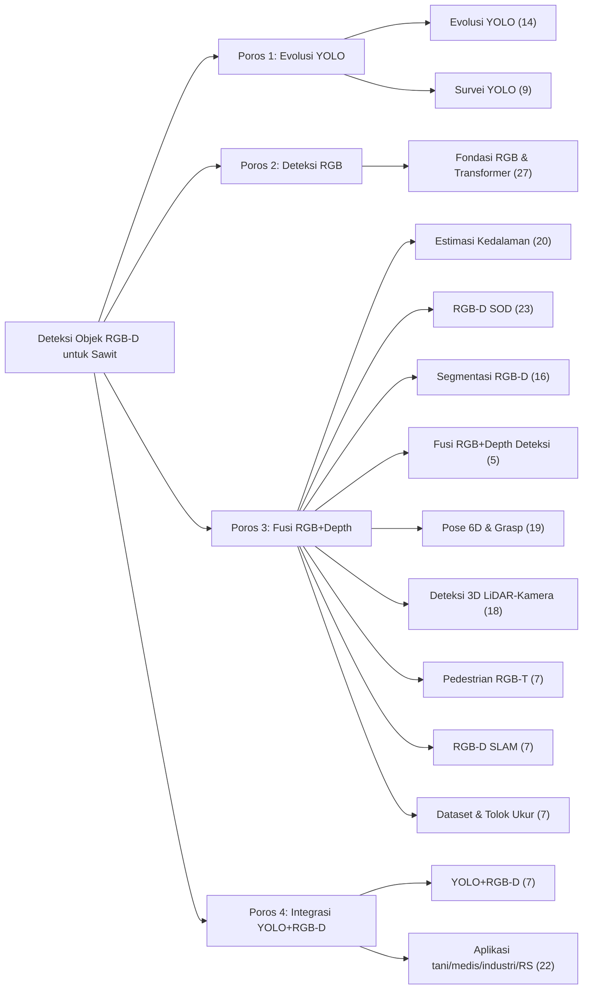

# F01 — Taksonomi 4 Poros / 14 Klaster

## 1. Tujuan & tempat
Peta konsep korpus: memperlihatkan empat poros riset dan 14 klaster tematik
yang menaunginya. Dirujuk di `\section{Pendahuluan}` (`main.tex`,
Gambar~\ref{fig:taksonomi}) dan Tabel~\ref{tab:taksonomi}. Sumber:
`TEMUAN.md` §4.

## 2. Konten faktual (node & edge — jangan tambah/kurangi)
Akar: **Deteksi Objek RGB-D untuk Sawit**. Empat cabang poros; tiap poros
menaungi klaster (angka = jumlah karya inti). Jumlah antarklaster tidak boleh dijumlahkan: satu karya dapat berada pada lebih dari satu klaster sehingga total badge bukan jumlah korpus:

- **Poros 1 — Evolusi YOLO**
  - Evolusi YOLO (14)
  - Survei YOLO (9)
- **Poros 2 — Deteksi Objek Berbasis RGB**
  - Fondasi RGB & Transformer (27)
- **Poros 3 — Fusi RGB+Depth**
  - Estimasi Kedalaman (20)
  - RGB-D Salient Object Detection (23)
  - Segmentasi Semantik RGB-D (16)
  - Fusi RGB+Depth untuk Deteksi (5)
  - Pose 6D & Grasp Robotik (19)
  - Deteksi 3D LiDAR–Kamera (18)
  - Pedestrian Multispektral RGB-T (7)
  - RGB-D SLAM Dinamis (7)
  - Dataset & Tolok Ukur (7)
- **Poros 4 — Integrasi YOLO+RGB-D**
  - YOLO+RGB-D (7)  ← *klaster inti, ditekankan*
  - Aplikasi (tani/medis/industri/RS) (22)

## 3. Rujukan tema
Ikuti `figures/THEME.md`. Warnai tiap poros dengan satu jewel-tone (Poros 1
`#0F766E`, Poros 2 `#2B6CB0`, Poros 3 `#8B5CB4`, Poros 4 aksen `#A03028`).
Klaster inti **YOLO+RGB-D** diberi outline aksen tebal.

## 4. Prompt siap-tempel Gemini
```
Buat diagram pohon/mind-map horizontal (lanskap) untuk artikel jurnal IEEE.
Tema WAJIB: latar #FAF9F6; garis & teks #1A1D21; aksen #A03028; hairline
#E6E3DA; tanpa bayangan/gradasi; sudut node membulat halus; label sans,
angka mono; kontras AA. Satu node akar "Deteksi Objek RGB-D untuk Sawit"
bercabang ke 4 node poros, tiap poros ke klaster berikut (angka dalam
kurung = badge kecil): Poros 1 Evolusi YOLO -> [Evolusi YOLO (14), Survei
YOLO (9)]; Poros 2 Deteksi RGB -> [Fondasi RGB & Transformer (27)]; Poros 3
Fusi RGB+Depth -> [Estimasi Kedalaman (20), RGB-D SOD (23), Segmentasi
RGB-D (16), Fusi RGB+Depth Deteksi (5), Pose 6D & Grasp (19), Deteksi 3D
LiDAR-Kamera (18), Pedestrian RGB-T (7), RGB-D SLAM (7), Dataset & Tolok
Ukur (7)]; Poros 4 Integrasi -> [YOLO+RGB-D (7), Aplikasi (22)]. Warnai
Poros 1 #0F766E, Poros 2 #2B6CB0, Poros 3 #8B5CB4, Poros 4 #A03028. Beri
outline aksen tebal pada node "YOLO+RGB-D (7)". Tambahkan catatan kaki
kecil: "Jumlah antarklaster tidak dijumlahkan; satu karya dapat muncul pada lebih dari satu klaster." Struktur pasti; jangan tambah/kurangi node. Ekspor SVG/PDF vektor.
```

## 5. Sumber mermaid (spesifikasi kebenaran / fallback)

