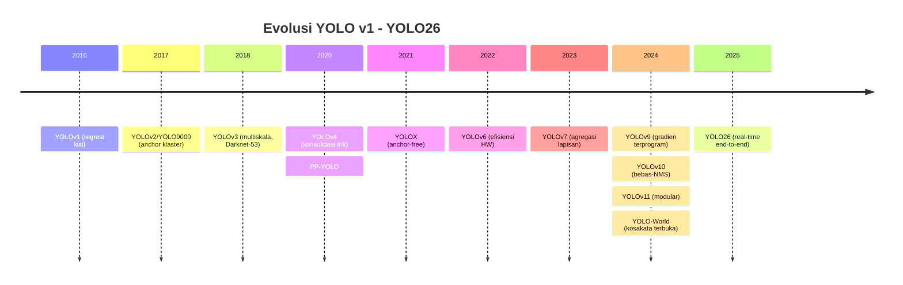

# F02 — Garis Waktu Evolusi YOLO (v1 → YOLO26)

## 1. Tujuan & tempat
Menata kronologi versi YOLO dan penanda arsitektural utamanya. Dirujuk di
`\section{Evolusi dan Survei YOLO}` (`main.tex`, Gambar~\ref{fig:timeline}).
Sumber: entri 1–11, 156, 192; selaras Tabel~\ref{tab:yolo}.

## 2. Konten faktual (titik waktu — tahun : versi : penanda)
- 2016 : YOLOv1 : regresi kisi satu-tahap
- 2017 : YOLOv2/YOLO9000 : anchor berbasis klaster
- 2018 : YOLOv3 : prediksi multiskala, Darknet-53
- 2020 : YOLOv4 : konsolidasi trik; PP-YOLO : penyetelan tanpa ubah arsitektur
- 2021 : YOLOX : anchor-free, label dinamis
- 2022 : YOLOv6 : efisiensi perangkat keras
- 2023 : YOLOv7 : agregasi lapisan terarah
- 2024 : YOLOv9 (gradien terprogram); YOLOv10 (bebas-NMS); YOLOv11 (kerangka
  modular); YOLO-World (kosakata-terbuka berpandu teks)
- 2025 : YOLO26 : real-time ujung-ke-ujung tanpa NMS

Penanda transisi kunci: (a) 2021 mulai anchor-free; (b) 2024 mulai bebas-NMS.

## 3. Rujukan tema
Ikuti `figures/THEME.md`. Sumbu waktu horizontal hairline `#E6E3DA`; node
versi tinta `#1A1D21`; dua penanda transisi (anchor-free, bebas-NMS) diberi
aksen `#A03028`.

## 4. Kontrak produksi GPT Image 2
```
Buat timeline horizontal (lanskap) untuk jurnal IEEE. Tema WAJIB: latar
#FAF9F6; garis/teks #1A1D21; aksen #A03028; hairline #E6E3DA; tanpa
bayangan/gradasi; label sans, tahun mono; kontras AA. Sumbu waktu 2016..2025
dengan penanda: 2016 YOLOv1 (regresi kisi satu-tahap); 2017 YOLOv2/YOLO9000
(anchor klaster); 2018 YOLOv3 (multiskala, Darknet-53); 2020 YOLOv4
(konsolidasi trik) + PP-YOLO; 2021 YOLOX (anchor-free); 2022 YOLOv6
(efisiensi HW); 2023 YOLOv7 (agregasi lapisan); 2024 YOLOv9 + YOLOv10
(bebas-NMS) + YOLOv11 + YOLO-World; 2025 YOLO26 (real-time end-to-end).
Tandai dua tonggak dengan aksen: "mulai anchor-free (2021)" dan "mulai
bebas-NMS (2024)". Struktur pasti; jangan tambah versi. Hasilkan PNG GPT Image 2 tanpa judul global, subjudul, nomor, atau caption internal.
```

## 5. Struktur mermaid (spesifikasi kebenaran)

