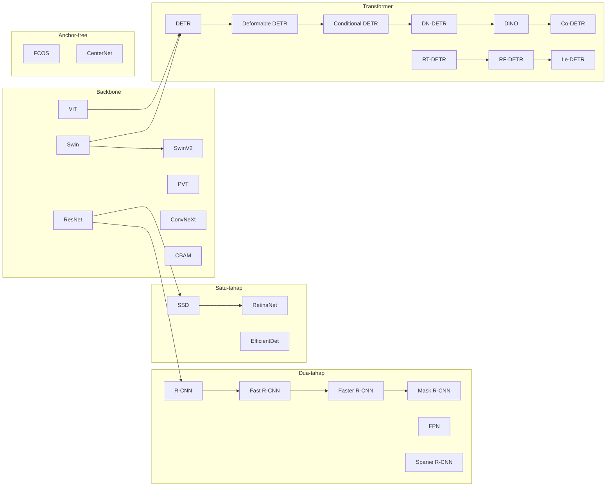

# F03 — Silsilah Detektor RGB

## 1. Tujuan & tempat
Pohon silsilah paradigma detektor RGB dan pewarisan gagasannya. Dirujuk di
`\section{Fondasi Deteksi Objek RGB}` (`main.tex`, Gambar~\ref{fig:silsilah};
figur lebar dua kolom). Sumber: entri 12–25, 155–165, 193–194.

## 2. Konten faktual (empat cabang → node)
- **Dua-tahap:** R-CNN → Fast R-CNN → Faster R-CNN → Mask R-CNN; FPN; Sparse R-CNN
- **Satu-tahap:** SSD → RetinaNet (focal loss); EfficientDet
- **Anchor-free:** FCOS; CenterNet
- **Transformer:** DETR → Deformable DETR → Conditional DETR → DN-DETR → DINO →
  Co-DETR; RT-DETR → RF-DETR → Le-DETR
- **Backbone (baris dasar, memasok semua cabang):** ResNet; ViT; Swin →
  Swin V2; PVT; ConvNeXt; CBAM (modul atensi)

Edge utama: panah pewarisan mengikuti urutan di atas (mis. R-CNN→Fast R-CNN).
ResNet menopang cabang dua-tahap & satu-tahap; ViT/Swin menopang transformer.

## 3. Rujukan tema
Ikuti `figures/THEME.md`. Empat cabang diberi warna Fondasi RGB `#2B6CB0`
(gradasi ringan antar-subkelompok tidak diperbolehkan; pakai label kelompok).
Baris backbone abu `#4A5568`. Node real-time (RT-/RF-/Le-DETR, YOLO tie-in)
diberi aksen `#A03028` tipis.

## 4. Kontrak produksi GPT Image 2
```
Buat diagram silsilah/pohon horizontal lebar (lanskap) untuk jurnal IEEE.
Tema WAJIB: latar #FAF9F6; garis/teks #1A1D21; aksen #A03028; hairline
#E6E3DA; tanpa bayangan/gradasi; sudut membulat; label sans, nama model mono;
kontras AA. Empat jalur berlabel: (1) Dua-tahap: R-CNN -> Fast R-CNN ->
Faster R-CNN -> Mask R-CNN; FPN; Sparse R-CNN. (2) Satu-tahap: SSD ->
RetinaNet; EfficientDet. (3) Anchor-free: FCOS; CenterNet. (4) Transformer:
DETR -> Deformable DETR -> Conditional DETR -> DN-DETR -> DINO -> Co-DETR;
RT-DETR -> RF-DETR -> Le-DETR. Baris dasar "Backbone": ResNet, ViT, Swin ->
Swin V2, PVT, ConvNeXt, CBAM, memasok panah ke jalur di atas. Warnai jalur
1-4 dengan #2B6CB0, baris backbone #4A5568, node real-time (RT/RF/Le-DETR)
outline #A03028. Struktur pasti; jangan tambah node. Hasilkan PNG GPT Image 2 tanpa judul global, subjudul, nomor, atau caption internal.
```

## 5. Struktur mermaid (spesifikasi kebenaran)

