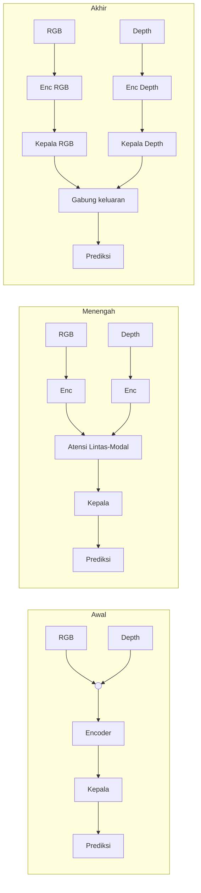

# F04 — Tiga Strategi Fusi RGB-D

## 1. Tujuan & tempat
Diagram blok tiga titik penggabungan warna dan kedalaman. Dirujuk di
`\section{Fusi RGB--Depth}` (`main.tex`, Gambar~\ref{fig:strategi}); selaras
Tabel~\ref{tab:fusi}. Sumber: taksonomi §5 + T3.

## 2. Konten faktual (tiga panel sejajar)
Aliran umum tiap panel: `RGB` dan `Depth` → (encoder) → **titik fusi** →
(kepala) → `Prediksi`.
- **Fusi awal:** gabung di masukan/fitur dangkal (konkatenasi kanal).
  Contoh: FuseNet, Expandable YOLO. Sifat: sederhana, parameter minim; rentan
  depth bising.
- **Fusi menengah:** gabung fitur multilevel dengan atensi lintas-modal.
  Contoh: SA-Gate, CMX, CIR-Net. Sifat: akurasi tertinggi pada adegan padat;
  biaya komputasi lebih besar. ← *ditekankan (relevan untuk sawit)*
- **Fusi akhir:** gabung keluaran dua cabang independen (rata-rata/pilih).
  Contoh: JL-DCF, deteksi-lalu-proyeksi. Sifat: modular, tahan hilang-
  modalitas; abaikan interaksi fitur.

## 3. Rujukan tema
Ikuti `figures/THEME.md`. Aliran RGB warna Fondasi RGB `#2B6CB0`; aliran
Depth warna Kedalaman `#A6740E`; blok fusi menengah diberi aksen `#A03028`.

## 4. Prompt siap-tempel Gemini
```
Buat tiga diagram blok sejajar (lanskap) untuk jurnal IEEE. Tema WAJIB: latar
#FAF9F6; garis/teks #1A1D21; aksen #A03028; hairline #E6E3DA; tanpa
bayangan/gradasi; sudut membulat; label sans; kontras AA. Setiap panel punya
dua aliran masuk "RGB" (#2B6CB0) dan "Depth" (#A6740E) melalui encoder,
bertemu di titik fusi, lalu kepala -> "Prediksi". Panel 1 "Fusi Awal": titik
fusi di masukan (konkatenasi kanal); contoh FuseNet, Expandable YOLO. Panel 2
"Fusi Menengah": beberapa titik fusi di fitur menengah dengan blok "Atensi
Lintas-Modal" (outline #A03028); contoh SA-Gate, CMX, CIR-Net. Panel 3 "Fusi
Akhir": dua cabang penuh terpisah, digabung di keluaran (rata-rata/pilih);
contoh JL-DCF. Struktur pasti; jangan tambah blok. Ekspor SVG/PDF vektor.
```

## 5. Sumber mermaid (fallback)

