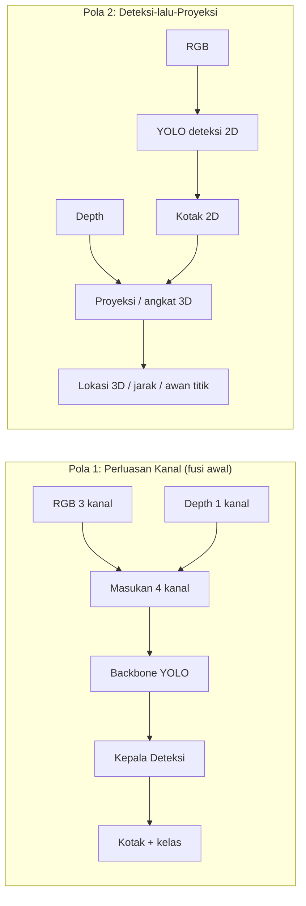

# F05 — Dua Pola Integrasi YOLO + RGB-D

## 1. Tujuan & tempat
Diagram alur dua pola integrasi YOLO dengan kedalaman. Dirujuk di
`\section{Integrasi YOLO + RGB--D}` (`main.tex`, Gambar~\ref{fig:yolorgbd};
figur lebar dua kolom). Sumber: entri 112–119.

## 2. Konten faktual (dua jalur berdampingan)
- **Pola 1 — Perluasan kanal masukan (fusi awal):**
  `RGB (3 kanal) + Depth (1 kanal)` → `Masukan 4 kanal` → `Backbone YOLO` →
  `Kepala Deteksi` → `Kotak + kelas`.
  Contoh: Expandable YOLO; Ophoff dkk. (temuan: fusi menengah > masukan mentah).
  Sifat: murah; sensitif kualitas & penyelarasan depth.
- **Pola 2 — Deteksi-lalu-proyeksi:**
  `RGB` → `YOLO (deteksi 2D)` → `Kotak 2D`; `Depth` → `Proyeksi/angkat 3D` →
  `Lokasi 3D / jarak / awan titik`.
  Contoh: FusionVision, Chen dkk. (jarak), Xu dkk. (onboard), Tian dkk.
  (grasp), YOLOv8-URE, robot labu (Ito dkk.).
  Sifat: tahan depth bising; tak memperkuat pemisahan objek sulit.

## 3. Rujukan tema
Ikuti `figures/THEME.md`. Aliran RGB `#2B6CB0`; Depth `#A6740E`; node YOLO
dan hasil akhir diberi aksen `#A03028` (klaster inti YOLO+RGB-D).

## 4. Kontrak produksi GPT Image 2
```
Buat diagram alur dua panel berdampingan (lanskap lebar) untuk jurnal IEEE.
Tema WAJIB: latar #FAF9F6; garis/teks #1A1D21; aksen #A03028; hairline
#E6E3DA; tanpa bayangan/gradasi; sudut membulat; label sans, angka mono;
kontras AA. Panel kiri "Pola 1: Perluasan Kanal": "RGB (3 kanal)" (#2B6CB0)
dan "Depth (1 kanal)" (#A6740E) -> "Masukan 4 kanal" -> "Backbone YOLO"
(#A03028) -> "Kepala Deteksi" -> "Kotak + kelas". Panel kanan "Pola 2:
Deteksi-lalu-Proyeksi": "RGB" -> "YOLO deteksi 2D" (#A03028) -> "Kotak 2D";
lalu "Depth" (#A6740E) + "Kotak 2D" -> "Proyeksi/angkat 3D" -> "Lokasi 3D /
jarak / awan titik". Struktur pasti; jangan tambah node. Hasilkan PNG GPT Image 2 tanpa judul global, subjudul, nomor, atau caption internal.
```

## 5. Struktur mermaid (spesifikasi kebenaran)

