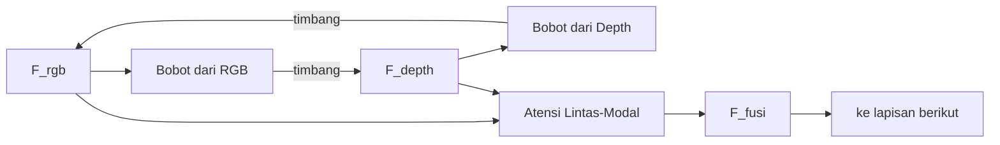

# F06 — Skema Atensi Lintas-Modal

## 1. Tujuan & tempat
Diagram blok mekanisme atensi lintas-modal (fusi menengah). Dirujuk di
`\section{Fusi RGB--Depth}` (`main.tex`, Gambar~\ref{fig:atensi}). Sumber:
entri 55 (SA-Gate), 46 (CIR-Net), 58 (CMX).

## 2. Konten faktual (aliran)
Dua fitur masuk: `F_rgb` dan `F_depth` (dari encoder masing-masing).
- `F_depth` menghasilkan **peta bobot** yang menimbang `F_rgb` (dan sebaliknya,
  dua arah/timbal balik).
- Hasil timbangan digabung → `F_fusi` → diteruskan ke lapisan berikut.
Anotasi mekanisme: "bobot spasial/kanal dari modalitas lain"; tujuan:
"tekan kontribusi depth bising, kuatkan isyarat andal". Contoh penerap:
SA-Gate (gerbang penyelarasan), CIR-Net (interaksi timbal balik),
CMX (rektifikasi + pertukaran fitur lintas-modal).

## 3. Rujukan tema
Ikuti `figures/THEME.md`. `F_rgb` `#2B6CB0`; `F_depth` `#A6740E`; blok atensi
& `F_fusi` aksen `#A03028`. Panah dua arah untuk timbal balik.

## 4. Kontrak produksi GPT Image 2
```
Buat diagram blok (lanskap) mekanisme atensi lintas-modal untuk jurnal IEEE.
Tema WAJIB: latar #FAF9F6; garis/teks #1A1D21; aksen #A03028; hairline
#E6E3DA; tanpa bayangan/gradasi; sudut membulat; label sans, simbol mono;
kontras AA. Dua kotak masuk: "F_rgb" (#2B6CB0) dan "F_depth" (#A6740E). Dari
tiap modalitas keluar "peta bobot" yang menimbang modalitas lain (panah dua
arah, timbal balik). Hasil bertemu di blok "Atensi Lintas-Modal" (#A03028)
-> "F_fusi" (#A03028) -> "ke lapisan berikut". Anotasi kecil: "tekan depth
bising, kuatkan isyarat andal". Contoh penerap tertulis di kaki: SA-Gate,
CIR-Net, CMX. Struktur pasti; jangan tambah blok. Hasilkan PNG GPT Image 2 tanpa judul global, subjudul, nomor, atau caption internal.
```

## 5. Struktur mermaid (spesifikasi kebenaran)

