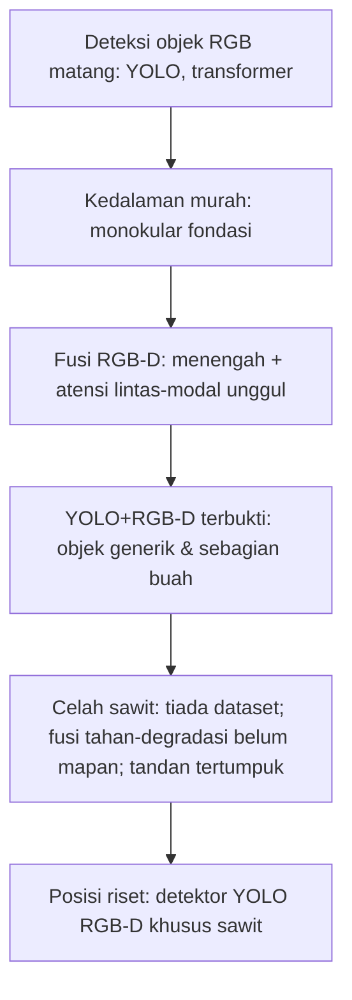

# F07 — Corong: Survei Umum → Celah Sawit

## 1. Tujuan & tempat
Diagram corong yang menyempit dari deteksi umum menuju celah spesifik sawit.
Dirujuk di `\section{Pendahuluan}` dan `\section{Sintesis dan Celah Riset}`
(`main.tex`, Gambar~\ref{fig:funnel}). Sumber: §10.

## 2. Konten faktual (lapisan corong, lebar → sempit)
1. Deteksi objek RGB matang (keluarga YOLO, transformer)
2. Kedalaman murah dari model monokular fondasi (MiDaS, Depth Anything V2)
3. Fusi RGB-D: fusi menengah + atensi lintas-modal unggul (SOD, segmentasi)
4. Integrasi YOLO+RGB-D terbukti pada objek generik & sebagian buah
5. **Celah sawit:** (a) tiada dataset sawit RGB-D beranotasi; (b) fusi tahan
   degradasi depth di bawah matahari belum mapan; (c) penghitungan tandan
   tertumpuk/teroklusi butuh pemisahan instans berbasis kedalaman
6. **Posisi riset:** detektor YOLO RGB-D khusus counting & klasifikasi sawit

## 3. Rujukan tema
Ikuti `figures/THEME.md`. Gradien lebar netral tinta→aksen tidak dipakai;
gunakan lapisan hairline `#E6E3DA` bertingkat, lapisan tersempit (celah +
posisi) diberi aksen `#A03028`.

## 4. Prompt siap-tempel Gemini
```
Buat diagram corong (funnel) vertikal-melebar-ke-sempit (orientasi lanskap
dengan corong di tengah) untuk jurnal IEEE. Tema WAJIB: latar #FAF9F6;
garis/teks #1A1D21; aksen #A03028; hairline #E6E3DA; tanpa bayangan/gradasi
mencolok; label sans; kontras AA. Enam lapisan dari terlebar ke tersempit:
(1) "Deteksi objek RGB matang (YOLO, transformer)"; (2) "Kedalaman murah:
model monokular fondasi"; (3) "Fusi RGB-D: menengah + atensi lintas-modal
unggul"; (4) "YOLO+RGB-D terbukti (objek generik & sebagian buah)"; (5)
"Celah sawit: tiada dataset RGB-D; fusi tahan-degradasi belum mapan;
penghitungan tandan tertumpuk" (#A03028); (6) "Posisi riset: detektor YOLO
RGB-D khusus counting & klasifikasi sawit" (#A03028). Struktur pasti; jangan
tambah lapisan. Ekspor SVG/PDF vektor.
```

## 5. Sumber mermaid (fallback)

