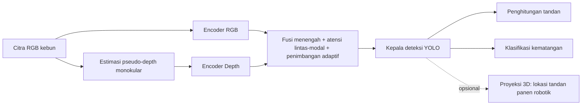

# F08 — Pipeline Usulan: YOLO RGB-D untuk Counting/Klasifikasi Sawit

## 1. Tujuan & tempat
Diagram alur pipeline konseptual usulan. Dirujuk di `\section{Sintesis dan
Celah Riset}` (`main.tex`, Gambar~\ref{fig:pipeline}; figur lebar dua kolom).
Sumber: §10 (konseptual; bukan hasil eksperimen).

## 2. Konten faktual (alur; tandai "usulan/konseptual")
1. `Citra RGB kebun` (kamera biasa)
2. Cabang A: `Encoder RGB`
3. Cabang B: `Estimasi pseudo-depth monokular` (mis. Depth Anything V2) →
   `Encoder Depth`
4. `Fusi menengah + atensi lintas-modal` (dengan penimbangan adaptif
   terhadap keandalan depth) ← inti kebaruan
5. `Kepala deteksi YOLO`
6. Dua keluaran: `Penghitungan tandan` dan `Klasifikasi kematangan`
7. (opsional) `Proyeksi 3D` → lokasi tandan untuk panen robotik

Catatan pada figur: label "konseptual — belum divalidasi eksperimen".

## 3. Rujukan tema
Ikuti `figures/THEME.md`. Cabang RGB `#2B6CB0`; cabang depth `#A6740E`; blok
fusi, kepala YOLO, dan dua keluaran diberi aksen `#A03028`.

## 4. Prompt siap-tempel Gemini
```
Buat diagram alur pipeline horizontal lebar (lanskap) untuk jurnal IEEE,
diberi label kecil "konseptual/usulan". Tema WAJIB: latar #FAF9F6; garis/teks
#1A1D21; aksen #A03028; hairline #E6E3DA; tanpa bayangan/gradasi; sudut
membulat; label sans, nama model mono; kontras AA. Alur: "Citra RGB kebun"
bercabang dua -> Cabang A "Encoder RGB" (#2B6CB0); Cabang B "Estimasi
pseudo-depth monokular (Depth Anything V2)" -> "Encoder Depth" (#A6740E).
Kedua cabang bertemu di "Fusi menengah + atensi lintas-modal + penimbangan
adaptif" (#A03028) -> "Kepala deteksi YOLO" (#A03028) -> dua keluaran sejajar
"Penghitungan tandan" dan "Klasifikasi kematangan" (#A03028); cabang opsional
putus-putus "Proyeksi 3D -> lokasi tandan (panen robotik)". Struktur pasti;
jangan tambah node. Ekspor SVG/PDF vektor.
```

## 5. Sumber mermaid (fallback)

